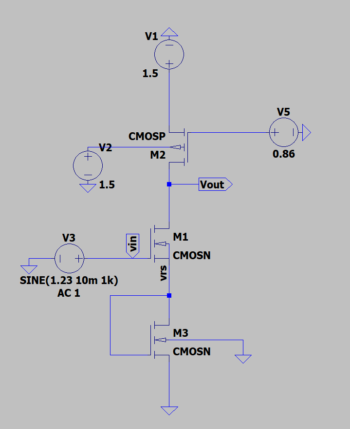
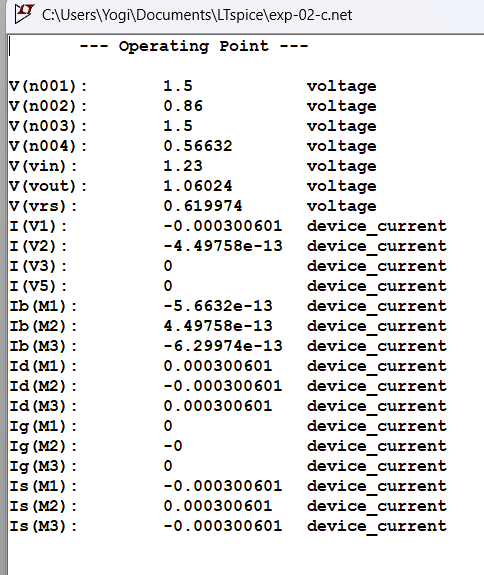
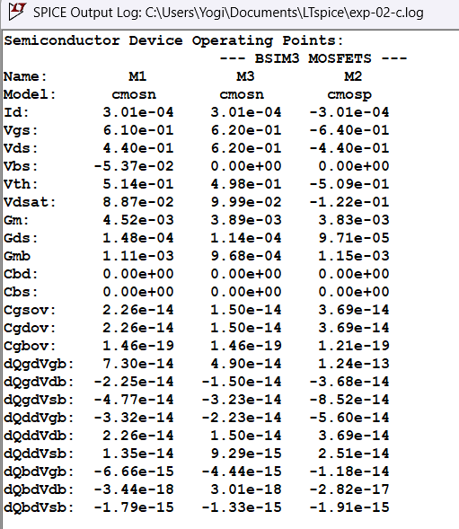
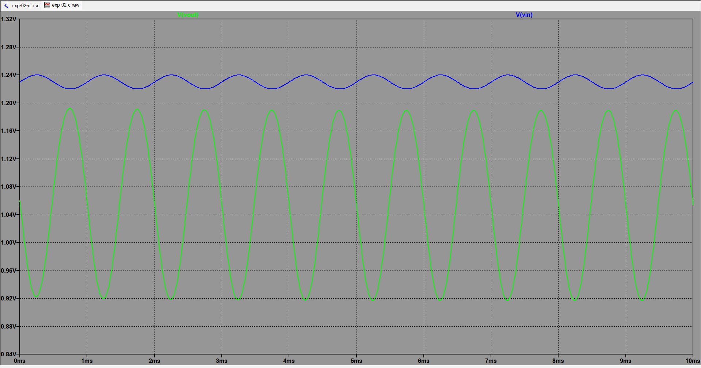
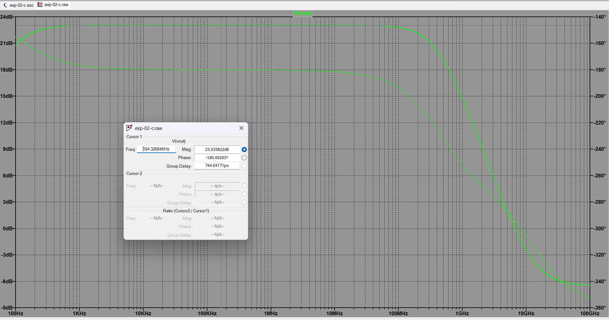
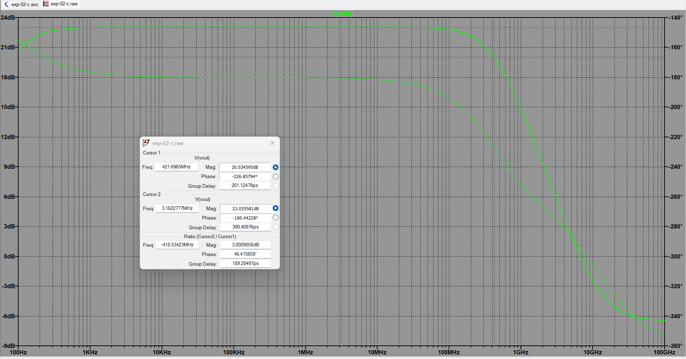
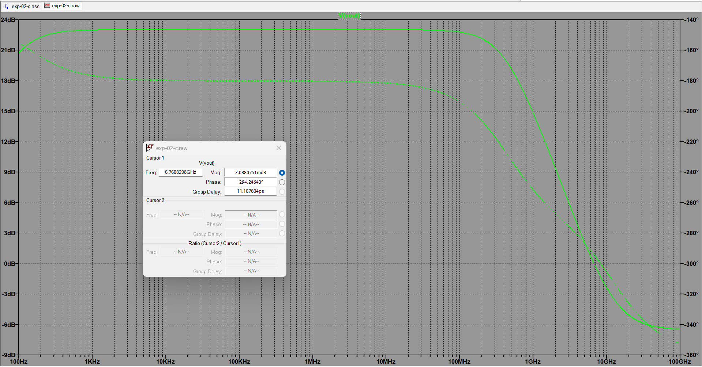

# Experiment 02: CS Amplifier Configurations using TSMC 180nm

## 1. Objective
To design and compare three different Common Source (CS) amplifier configurations using the TSMC 180nm parameter library in LTspice. The objective is to extract specific performance metrics, compare the configurations, and justify the interpretations.

---

## 2. Theory & Circuit Configurations
All three circuits utilize a PMOS active load ($M_2$) to provide a high output resistance, maximizing the intrinsic gain. The primary differences lie in the source degeneration networks applied to the input amplifying transistor ($M_1$).

### Configuration A: Resistor Degeneration ($R_S$)
* **Description:** A physical resistor $R_S$ is placed at the source of the input NMOS ($M_1$).
* **Purpose:** This provides ideal, perfectly linear source degeneration. It stabilizes the DC operating point and makes the amplifier highly linear, though it sacrifices some voltage gain. 
* **Trade-off:** Physical resistors consume a massive amount of silicon area in IC design and are subject to high manufacturing variations, making this configuration impractical for compact integrated circuits.
* **Theoretical Gain:** $$A_v=\frac{-g_{m1}}{1+g_{m1}R_S}$$

### Configuration B: Active Current Source Degeneration
* **Description:** The resistor is replaced by an NMOS ($M_3$) biased by a fixed DC voltage ($V_{B2}$), operating as a constant current source.
* **Purpose:** A MOSFET in saturation provides an extremely high output resistance ($r_{o3}$). This applies heavy degeneration, ensuring rock-solid DC bias stability without taking up the massive footprint of a physical resistor.
* **Trade-off:** The massive AC resistance looking into the drain of $M_3$ severely degrades the AC voltage signal. This is typically used for specific biasing control rather than maximizing signal amplification.

//

### Configuration C: Diode-Connected Degeneration
* **Description:** The source of $M_1$ is tied to an NMOS ($M_3$) configured with its gate and drain shorted together (diode-connected).
* **Purpose:** This is the IC designer's space-saving alternative to Configuration A. The diode-connected MOSFET acts as a small-signal resistor with a value of approximately $1/g_{m3}$. 
* **Advantage:** Because $M_1$ and $M_3$ are built on the same silicon, their transconductances ($g_{m1}$ and $g_{m3}$) track each other across temperature and process variations. The gain becomes a stable ratio of these parameters, making the circuit incredibly resilient.
* **Theoretical Gain (Approximate):**
  $$A_v\approx\frac{-g_{m1}}{1+\frac{g_{m1}}{g_{m3}}}$$

## 3. Simulation Results & Analysis

### 3.1 Configuration A: Resistor Degeneration ($R_S$)

#### 1. Transistor Sizing & Design Parameters
In 180nm CMOS design, the aspect ratios ($W/L$) are the primary design variables. The following sizes were utilized to achieve the desired operating point:
* **$M_1$ (NMOS Amplifying Device):** W = 15.3µm, L = 180nm
* **$M_2$ (PMOS Active Load):** W = 56.35µm, L = 180nm

#### 2. DC Analysis & Saturation Verification
The operating point was set to ensure all transistors operate securely in the saturation region. A source resistor $R_S$ of 666.67 Ω was used.

* **Supply Voltage ($V_{DD}$):** 1.5 V
* **Drain Current ($I_D$):** 300.7 µA
* **Total DC Power Dissipation:** 451.05 µW

**Saturation Proof for $M_1$:**
To act as a linear amplifier, $M_1$ must satisfy $V_{DS} > V_{GS} - V_{TH}$ (or $V_{DS} > V_{OV}$).
From the SPICE output log:
* $V_{GS}$ = 0.610 V
* $V_{TH}$ = 0.474 V
* Overdrive Voltage ($V_{OV}$) = 0.610 - 0.474 = 0.136 V
* Actual $V_{DS}$ = 0.750 V

Since **0.750 V > 0.136 V**, the amplifying transistor $M_1$ is deeply in saturation.

#### 3. DC Sweep Analysis
A DC sweep was performed to identify the high-gain linear region of the amplifier's transfer characteristic. The chosen DC bias of $V_{in}$ = 0.81 V places the operating point dead center in this linear region.

#### 4. Transient Analysis (Time Domain)
A 1 kHz sine wave with an amplitude of 10 mV (20 $mV_{p-p}$) was applied. 

* **Input Peak-to-Peak ($V_{in(p-p)}$):** 20 mV
* **Output Peak-to-Peak ($V_{out(p-p)}$):** 207.43 mV
* **Simulated Transient Gain:** 10.37 V/V

#### 5. AC Analysis (Frequency Domain)
An AC frequency sweep was performed to determine the small-signal gain and bandwidth.

* **AC Mid-Band Gain (Mag):** 20.826 dB
* **AC Linear Gain ($A_v$):** 10.99 V/V
* **Phase:** -180° (Inverting)

### 6. Theoretical vs. Simulated Gain Comparison

To verify our simulation, let's calculate the theoretical gain by hand using the small-signal values from the LTspice `.log` file. Since LTspice gives us drain-source conductance ($G_{ds}$), we just take the inverse to get the output resistance ($r_o$):

* $g_{m1} = 3.62 \text{ mA/V}$
* $r_{o1} = \frac{1}{G_{ds1}} = \frac{1}{1.00 \times 10^{-4}} = 10 \text{ k}\Omega$
* $r_{o2} = \frac{1}{G_{ds2}} = \frac{1}{7.45 \times 10^{-5}} = 13.42 \text{ k}\Omega$
* $R_S = 666.67 \text{ }\Omega$

As instructed, we are using the exact formula for a source-degenerated CS amplifier with an active load (taking channel length modulation into account where $\lambda \neq 0$):

$$A_v = \frac{-g_{m1}}{1 + g_{m1}R_S + \frac{R_S}{r_{o1}}} \times \left( [g_{m1} R_S r_{o1} + R_S + r_{o1}] \parallel r_{o2} \right)$$

**Step 1: Find the output resistance looking into the NMOS ($R_{out\_NMOS}$)**
First, we calculate the resistance looking down into $M_1$ with the source resistor included:
$$R_{out\_NMOS} = g_{m1} R_S r_{o1} + R_S + r_{o1}$$
$$R_{out\_NMOS} = (3.62\text{m})(666.67)(10\text{k}) + 666.67 + 10\text{k} \approx 34.8 \text{ k}\Omega$$

**Step 2: Find the total output resistance ($R_{out}$)**
Next, we put this in parallel with the PMOS load ($r_{o2}$):
$$R_{out} = 34.8\text{k} \parallel 13.42\text{k} = 9.69 \text{ k}\Omega$$

**Step 3: Find the effective transconductance ($G_{m(eff)}$)**
$$G_{m(eff)} = \frac{g_{m1}}{1 + g_{m1}R_S + \frac{R_S}{r_{o1}}}$$
$$G_{m(eff)} = \frac{3.62\text{m}}{1 + 2.413 + 0.067} = 1.04 \text{ mA/V}$$

**Step 4: Final Voltage Gain**
$$A_v = -G_{m(eff)} \times R_{out} = -1.04 \text{ mA/V} \times 9.69 \text{ k}\Omega = -10.07 \text{ V/V}$$

**Conclusion:** Our calculated theoretical gain magnitude is **10.07 V/V**, which is close to our Transient analysis gain of **10.37V/V** and simulated AC gain of **10.99 V/V**. 

**Why is there a small difference?**
Our hand calculation assumes $V_{BS} = 0$. However, because $R_S$ raises the source of $M_1$ above ground, it actually triggers the **body effect**. The LTspice log shows $g_{mb} = 7.96 \times 10^{-4} \text{ A/V}$. We ignored this in our hand formula to keep the math manageable, which explains the ~8% difference. 
Also, the simulated Transient gain (**10.37 V/V**) is slightly different from the AC gain because AC analysis is purely linear, while Transient analysis captures the slight non-linearities of the MOSFET during the 20 mV input swing.

---
# Experiment 2b: Common Source Amplifier with Active Load and Source Degeneration

## 1. Objective
To design, simulate, and analyze Configuration B—a Common Source (CS) amplifier utilizing an **active current source for source degeneration**—using the TSMC 180nm process in LTspice. The experiment follows a strict rules to evaluate its performance:

1. **DC Analysis:** Establish biasing strategies to fix the operating point, ensuring all transistors remain in the saturation region, and calculate the total DC power dissipation.
2. **DC Sweep:** Verify the transfer characteristics to secure a highly linear operating point.
3. **Transient Analysis:** Inject a small-signal input to verify time-domain linear amplification, and extract the voltage gain along with the maximum input and output voltage swings.
4. **AC Analysis:** Extract the frequency response metrics, including the midband Gain, 3dB Bandwidth, and Unity Gain Bandwidth (UGB).
5. **Mathematical Verification:** Compare the extracted simulation metrics against the exact small-signal theoretical model to justify the results and understand the trade-offs of active degeneration.

---

## 2. Circuit Diagram & Biasing Strategy
The circuit is a Common Source amplifier consisting of three MOSFETs. To keep all transistors in the saturation region, the DC bias voltages were calculated based on three initial design assumptions: a target drain current of **ID = 0.3 mA**, an overdrive voltage of **VOV = 0.25V**, and a degeneration voltage drop of **VRS = 0.30V**.

Based on these targets, the voltage sources were derived as follows:

* **M1 (NMOS Amplifying Transistor):** Assuming a typical 180nm NMOS threshold voltage (VTH ~ 0.36V), the required DC gate-to-source voltage is VGS = VTH + VOV = 0.61V. Since the source sits at 0.30V (VRS), the input DC bias is:
  **VIN** = VGS + VRS = 0.60V + 0.30V = **0.90V**.

* **M2 (NMOS Current Source):** M2 provides active source degeneration. Its source is grounded, meaning its gate bias (VB2) directly sets its VGS. To sink the target 0.3 mA, it requires a VGS of roughly 0.60V. After minor SPICE tuning for its specific VTH, this was locked at:
  **VB2 = 0.61V**.

* **M3 (PMOS Active Load):** Its source is tied to VDD (1.50V). To push exactly 0.3 mA down into the circuit, it requires an absolute |VGS| of approximately 0.64V based on our selected aspect ratio. Therefore, the gate bias is:
  **VB1** = VDD - |VGS| = 1.50V - 0.64V = **0.86V**.

---

## 3. Theoretical Formulation
To understand the behavior of this amplifier, we rely on its small-signal model. In this configuration, the physical source resistor is replaced by an active NMOS current source (M2). While M2 provides excellent DC bias stability, it introduces an extremely large small-signal output resistance ($r_{o2}$) at the source of the amplifying transistor (M1).

The standard, simplified gain equation for a source-degenerated amplifier is:
$$A_v \approx \frac{-g_{m1} r_{o3}}{1 + g_{m1} r_{o2}}$$

However, because the active degeneration resistance ($r_{o2}$) is exceptionally large, we cannot ignore the channel-length modulation of the main amplifier (M1). Ignoring the intrinsic output resistance ($r_{o1}$) leads to significant theoretical errors. Therefore, to accurately predict the midband gain and match our SPICE simulations, we must use the exact small-signal equation:
$$A_v = \frac{-g_{m1}}{1 + g_{m1} r_{o2} + \frac{r_{o2}}{r_{o1}}} \times \left( \left[ g_{m1} r_{o2} r_{o1} + r_{o2} + r_{o1} \right] \parallel r_{o3} \right)$$

*(Note: This exact theoretical model will be calculated using extracted SPICE parameters and compared against the simulated AC frequency response in Section 8).*

---

## 4. DC Analysis (Operating Point)
After setting up the bias voltages, a DC operating point simulation was performed. This step verifies that our hand calculations work in the actual SPICE model and ensures that all transistors are operating in the saturation region ($|V_{DS}| > |V_{DSAT}|$). It also allows us to calculate the circuit's total power dissipation.

### DC Parameters Table
| Transistor | ID (mA) | VGS (V) | VTH (V) | VDS (V) | VDSAT (V) | Region |
| :--- | :--- | :--- | :--- | :--- | :--- | :--- |
| **M1 (NMOS)** | 0.30 | 0.60 | 0.476 | 0.754 | 0.099 | Saturation |
| **M2 (NMOS)** | 0.30 | 0.61 | 0.500 | 0.300 | 0.094 | Saturation |
| **M3 (PMOS)** | -0.30 | -0.64 | -0.509 | -0.445 | -0.122 | Saturation |

**Total DC Power Dissipation:**
Since the entire circuit consists of a single branch drawing 0.30 mA from the 1.50V supply, the total DC power is calculated as:
$$P_{DC} = V_{DD} \times I_D = 1.50\text{ V} \times 0.30\text{ mA} = 0.45\text{ mW} \text{ (or } 450\text{ }\mu\text{W)}$$

**Verification of Biasing:**
* **Input Bias (VIN):** 0.90V
* **Output Bias (VOUT):** 1.054V

To confirm our design values, we can check the node voltages. The input DC bias (VIN) is 0.90V. Since M1 has a simulated VGS of 0.60V, the source voltage must be exactly 0.30V ($0.90\text{V} - 0.60\text{V}$). This perfectly matches the VDS of M2, showing that our active degeneration network is working exactly as we planned. 

Additionally, for the PMOS active load (M3), saturation is confirmed using absolute values ($|-0.445\text{V}| > |-0.122\text{V}|$). Because all three transistors satisfy the saturation condition, the circuit is ready to function as a linear amplifier.

---

## 5. DC Sweep Analysis (Voltage Transfer Characteristic)
While the operating point confirms the transistors are in saturation at exactly 0.90V, a DC sweep is necessary to visualize the overall Voltage Transfer Characteristic (VTC). This ensures that our chosen 0.90V bias does not sit too close to the cutoff or triode boundaries, but rather dead-center in the steepest (highest gain) linear amplification region.

*Observation:* The curve confirms that 0.90V is an optimal bias point, residing safely within the linear segment of the VTC.

---

## 6. Transient Analysis (Time Domain)
Having secured a stable, high-gain DC operating point, we now inject a small-signal sine wave to observe the amplifier's real-time dynamic behavior and ensure the signal does not clip the boundaries identified in the DC sweep.

* **Input Signal:** Vin is a 1 kHz sine wave with a 10 mV peak amplitude (20 mV peak-to-peak) superimposed on our 0.90V DC offset.
* **Output Signal:** The amplified output is measured as **35.57 mV** peak-to-peak without distortion.

**Gain Calculation from Transient:**
$$A_v = \frac{V_{out(p-p)}}{V_{in(p-p)}} = \frac{35.57 \text{ mV}}{20 \text{ mV}} = 1.778 \text{ V/V}$$
$$A_v (\text{dB}) = 20 \log_{10}(1.778) \approx 5.00 \text{ dB}$$

---

## 7. AC Analysis (Frequency Domain)
While transient analysis confirms time-domain small-signal amplification, an AC frequency sweep is required to determine the bandwidth limits and the precise linear midband gain of the amplifier.

### Midband Gain
The measured midband AC gain is **5.08 dB**, which strongly correlates with our transient calculation.

### 3dB Bandwidth
The upper cut-off frequency is located at the point where the gain drops by approximately 3 dB from its midband value.
* **Measured Frequency:** 238.23 MHz

### Unity Gain Bandwidth (UGB)
The Unity Gain Bandwidth is the frequency at which the amplifier's gain drops to 0 dB.
* **Measured UGB:** 458.14 MHz

*Note: The UGB is relatively close to the 3dB bandwidth because the initial midband gain is very low (5.08 dB). The amplifier only needs to attenuate the signal by ~5 dB to reach unity gain.*

---

## 8. Theoretical vs. Simulated Gain Verification
To verify that our simulator is behaving accurately according to semiconductor physics, we extract the small-signal parameters from the SPICE error log and run them through the exact analytical formula established in Section 3.

From the log, we extract:
* $g_{m1} = 3.85 \text{ mA/V}$
* $r_{o1} \approx 10 \text{ k}\Omega$ *(Output resistance of M1)*
* $r_{o2} = 5.26 \text{ k}\Omega$ *(Degeneration resistance from M2)*
* $r_{o3} = 10.47 \text{ k}\Omega$ *(Active load resistance from PMOS M3)*

**Step 1: Find the output resistance looking into the NMOS ($R_{out\_NMOS}$)**
First, we calculate the massive resistance looking down into M1 degenerated by M2:
$$R_{out\_NMOS} = g_{m1} r_{o2} r_{o1} + r_{o2} + r_{o1}$$
$$R_{out\_NMOS} = (3.85\text{m})(5.26\text{k})(10\text{k}) + 5.26\text{k} + 10\text{k} \approx 202.51\text{k} + 15.26\text{k} = 217.77 \text{ k}\Omega$$

**Step 2: Find the total output resistance ($R_{out}$)**
Next, we place this in parallel with the PMOS active load ($r_{o3}$):
$$R_{out} = 217.77\text{k} \parallel 10.47\text{k} = \frac{217.77 \times 10.47}{217.77 + 10.47} \approx 9.99 \text{ k}\Omega$$

**Step 3: Find the effective transconductance ($G_{m(eff)}$)**
$$G_{m(eff)} = \frac{g_{m1}}{1 + g_{m1} r_{o2} + \frac{r_{o2}}{r_{o1}}}$$
$$G_{m(eff)} = \frac{3.85\text{m}}{1 + 20.251 + 0.526} = \frac{3.85\text{m}}{21.777} \approx 0.1768 \text{ mA/V}$$

**Step 4: Final Voltage Gain**
$$A_v = -G_{m(eff)} \times R_{out} = -0.1768 \text{ mA/V} \times 9.99 \text{ k}\Omega = -1.766 \text{ V/V}$$
$$A_v \text{ (dB)} = 20 \log_{10}(1.766) = 4.94 \text{ dB}$$

**Mathematical Verdict:** Our calculated theoretical gain is **1.766 V/V (4.94 dB)**. This is remarkably close to our simulated Transient gain of **1.778 V/V (5.00 dB)** and simulated AC gain of **5.08 dB**. The highly marginal ~0.14 dB difference is primarily attributed to the body effect ($g_{mb}$) on M1 triggered by the elevated source voltage from M2, which is accurately captured in SPICE but omitted in our hand calculations for mathematical clarity.

---

## 9. Conclusion
The Configuration B Common Source Amplifier was successfully designed, simulated, and mathematically verified. The progressive workflow from hand-calculated bias design to DC analysis confirmed that the main amplifier, active load, and current source were all securely biased into the saturation region exactly as predicted. 

While replacing a physical source resistor with an active current source (M2) saves physical silicon area and provides exceptional bias stability, its massive degeneration resistance severely penalizes the voltage gain. As a result, the simulated midband gain dropped to **5.08 dB** (compared to earlier non-degenerated topologies). However, as a trade-off for the low gain, the heavy degeneration allows the circuit to exhibit a highly stable and broad operational bandwidth, successfully achieving a UGB of **458.14 MHz**. The tight correlation between our exact theoretical hand-calculations and the SPICE AC analysis confirms the validity of the small-signal model and concludes the experiment successfully.

---
# Experiment 2(c) — Common Source Amplifier with Active Load and Diode-Connected Source Degeneration

**Course:** Linear Integrated Circuits Lab — BEC456B  
**Technology:** TSMC 180nm CMOS | **Simulator:** LTSpice XVII  
**VDD = 1.5V | P ≤ 0.5mW | L = 180nm**

---

## 1. Aim

The aim of this experiment is to design and simulate a Common Source (CS) amplifier with a PMOS active load and a diode-connected NMOS source degeneration transistor, using TSMC 180nm CMOS technology in LTSpice. The specific objectives are:

1. Fix the DC operating point so that all transistors are in saturation and verify that power consumption is within the given budget.
2. Run a transient simulation to confirm the amplifier operates linearly without distortion.
3. Determine the voltage gain, maximum output swing, and maximum input swing, and compare them with theoretical values.
4. Run an AC simulation and extract the mid-band gain, 3dB bandwidth, and Unity Gain Bandwidth (UGB) with no external load capacitance.
5. Justify any differences between the theoretical and simulated results.

---

## 2. Circuit Description

The circuit uses three MOSFETs. **M1 (NMOS)** is the amplifying transistor configured in common source — the input is applied to its gate and the output is taken from its drain. **M2 (PMOS)** is the active load — its gate is held at a fixed DC bias of 0.86V by voltage source V5, which sets a fixed Vgs for M2 and therefore a fixed quiescent drain current. Using M2 as a load instead of a resistor gives a significantly higher output resistance (ro2 = 10.3 kΩ), which directly increases the voltage gain. **M3 (NMOS)** is a diode-connected transistor (gate shorted to drain) placed in series between the source of M1 and GND. It acts as a nonlinear source degeneration element, presenting a small-signal impedance of approximately (1/gm3 ∥ ro3) at the source of M1.

It is important to note that M3 is **not** a current mirror. M1 and M3 are connected in series, and by Kirchhoff's Current Law (KCL), series-connected devices always carry the same drain current — this is a circuit topology constraint, not a mirroring effect. A current mirror operates through parallel branches sharing the same Vgs; that is not the case here.

VDD = 1.5V is connected to the source of M2. The input signal is applied via V3: `SINE(1.23V, 10mV, 1kHz) AC 1`. The output Vout is taken at the common drain node of M1 and M2. No external load capacitor is connected — the bandwidth is determined purely by the intrinsic MOSFET parasitic capacitances at the output node.

---

## 3. Design Procedure

### 3.1 Given Specifications

- Supply voltage: VDD = 1.5V
- Maximum power dissipation: P ≤ 0.5mW
- Technology: TSMC 180nm CMOS
- Channel length: L = 180nm (given for all transistors)

### 3.2 Step 1 — Finding the Drain Current

The maximum permissible drain current was determined from the power budget:

$$I_D = \frac{P}{V_{DD}} = \frac{0.5 \times 10^{-3}}{1.5} = 0.333 \text{ mA}$$

This is the upper bound on quiescent current. The simulation yielded Id = 0.301 mA, giving a power of 0.452 mW — within the 0.5mW limit.

### 3.3 Step 2 — Setting the Output DC Voltage

The DC operating point Vout was chosen to maximize the linear output swing while keeping all transistors in saturation throughout the swing.

For the output to swing without any transistor entering triode, the following voltage boundaries apply:

- **Lower limit** — Vout cannot go below the sum of Vdsat of M1 and M3 (series stack):
$$V_{out,min} = V_{DS,sat,M1} + V_{DS,sat,M3} = 0.089 + 0.100 = 0.189 \text{ V}$$

- **Upper limit** — Vout cannot go above VDD minus the Vdsat of M2:
$$V_{out,max} = V_{DD} - |V_{DS,sat,M2}| = 1.5 - 0.122 = 1.378 \text{ V}$$

Starting from VDD/2 = 0.75V as a reference and accounting for available headroom using VDD − 0.6 = 0.9V as the target center, Vout(DC) was set at:

$$V_{out,DC} = V_{DD} - 0.44 = 1.5 - 0.44 = \mathbf{1.06 \text{ V}}$$

The simulation confirmed V(vout) = **1.06024 V** ✓

This places Vout closer to VDD rather than the center, resulting in an intentionally asymmetric headroom: 0.318V upward swing and 0.871V downward swing. This asymmetry is by design — the M1+M3 series stack at the bottom has a lower combined Vdsat (0.089 + 0.100 = 0.189V) compared to M2 alone at the top (Vdsat = 0.122V), meaning the lower rail offers more headroom. Placing Vout higher exploits this and avoids unnecessarily restricting the downward swing.

### 3.4 Step 3 — Setting the Input Bias (Vin DC)

The DC gate voltage of M1 was tuned to achieve Id = 0.301mA at Vout = 1.06V, while ensuring M1 remains in saturation. From the BSIM3 log:

- Vgs(M1) = 0.610V, Vth(M1) = 0.514V → Vov = **0.096V**
- Vds(M1) = 0.440V >> Vov(M1) → **M1 is in saturation** ✓

The DC input bias was set to **Vin = 1.23V**.

### 3.5 Step 4 — Setting M2 Gate Bias

M2 (PMOS) gate is held at VB1 = 0.86V by V5:

- Vgs(M2) = 0.86 − 1.5 = −0.64V
- |Vth(M2)| = 0.509V → |Vov(M2)| = 0.131V
- |Vds(M2)| = 0.440V > |Vov(M2)| → **M2 is in saturation** ✓

### 3.6 Step 5 — W/L Sizing

All transistors use L = 180nm. Widths were calculated using the long-channel drain current equation in saturation:

$$I_D = \frac{1}{2} \mu C_{ox} \frac{W}{L} V_{ov}^2$$

Each transistor was sized to carry the target Id at its respective overdrive voltage. M2 requires a significantly larger width because PMOS hole mobility (µp) is approximately half of NMOS electron mobility (µn), requiring roughly double the width to carry the same current at a comparable Vov. The final device dimensions are:

- **M1 (NMOS):** W = 27.47 µm, L = 180nm → W/L = 152.6
- **M3 (NMOS):** W = 18.27 µm, L = 180nm → W/L = 101.5
- **M2 (PMOS):** W = 58.1 µm, L = 180nm → W/L = 322.8

---

## 4. DC Operating Point Results

The .op simulation confirms the node voltages and device parameters at the quiescent point:

- V(vin) = 1.23V — M1 gate bias as designed
- V(vout) = **1.06024V** — matches the design target ✓
- V(vrs) = 0.620V — source of M1 / drain of M3

Since M1 and M3 are in series, KCL requires both to carry the same drain current. All three transistors show **Id = 0.301 mA**, consistent with the series current constraint and the fixed bias set by V5 on M2.

**Power dissipation:**
$$P = V_{DD} \times I_{D} = 1.5 \times 0.301 \times 10^{-3} = \mathbf{0.4515 \text{ mW} \leq 0.5 \text{ mW}} \checkmark$$

**Saturation verification** (Vds > Vdsat required for each transistor):

- M1: Vds = 0.440V >> Vdsat = 0.089V → **Saturation** ✅ (margin: 4.9×)
- M3: Vds = 0.620V >> Vdsat = 0.100V → **Saturation** ✅ (margin: 6.2×)
- M2: |Vds| = 0.440V >> |Vdsat| = 0.122V → **Saturation** ✅ (margin: 3.6×)

All transistors are deeply in saturation, validating the small-signal model used in Section 5.

The small-signal parameters extracted from the BSIM3 log for gain calculations: gm1 = 4.52 mS, gm3 = 3.89 mS, gds1 = 0.148 mS, gds2 = 0.0971 mS, gds3 = 0.114 mS.

---

## 5. Theoretical Gain Calculation

### 5.1 Computing ro Values

$$r_{o1} = \frac{1}{g_{ds1}} = \frac{1}{1.48 \times 10^{-4}} = \mathbf{6.757 \text{ k}\Omega}$$

$$r_{o2} = \frac{1}{g_{ds2}} = \frac{1}{9.71 \times 10^{-5}} = \mathbf{10.299 \text{ k}\Omega}$$

$$r_{o3} = \frac{1}{g_{ds3}} = \frac{1}{1.14 \times 10^{-4}} = \mathbf{8.772 \text{ k}\Omega}$$

$$\frac{1}{g_{m3}} = \frac{1}{3.89 \times 10^{-3}} = \mathbf{257.07 \ \Omega}$$

### 5.2 Applying the Gain Formula

The full general formula is used where **all three λ ≠ 0** — channel length modulation is accounted for in all three transistors. The formula from the reference sheet is:

$$A_V = \frac{-g_{m1}}{\left[1 + g_{m1}\left(\frac{1}{g_{m3}} \| r_{o3}\right) + \frac{1}{\left(\frac{1}{g_{m3}} \| r_{o3}\right) \times r_{o1}}\right]} \times \left[g_{m1}\left(\frac{1}{g_{m3}} \| r_{o3}\right)r_{o1} + r_{o1} + \left(\frac{1}{g_{m3}} \| r_{o3}\right)\right] \| r_{o2}$$

**Step 1 — Compute the source degeneration impedance (1/gm3 ∥ ro3):**

This is the small-signal impedance presented by the diode-connected M3 at the source of M1.

$$\frac{1}{g_{m3}} \| r_{o3} = \frac{257.07 \times 8772}{257.07 + 8772} = \mathbf{249.75 \ \Omega}$$

Since 1/gm3 (257Ω) << ro3 (8.77kΩ), the parallel result is dominated by 1/gm3, confirming M3 primarily acts as a low-impedance source degeneration element.

**Step 2 — Denominator:**

$$\text{Denom} = 1 + (4.52 \times 10^{-3})(249.75) + \frac{1}{249.75 \times 6757}$$

$$= 1 + 1.1289 + 0.000001 = \mathbf{2.1289}$$

The third term (≈10⁻⁶) is negligible and has no practical effect.

**Step 3 — Numerator bracket (before parallel with ro2):**

$$\text{Num} = (4.52 \times 10^{-3})(249.75)(6757) + 6757 + 249.75$$

$$= 7627.5 + 6757 + 249.75 = \mathbf{14634.25 \ \Omega}$$

**Step 4 — Parallel with ro2:**

$$14634.25 \| 10299 = \frac{14634.25 \times 10299}{14634.25 + 10299} = \mathbf{6044.71 \ \Omega}$$

**Step 5 — Final gain:**

$$A_V = \frac{-4.52 \times 10^{-3}}{2.1289} \times 6044.71 = \mathbf{-12.83 \text{ V/V}}$$

$$\boxed{|A_V|_{dB} = 20\log_{10}(12.83) = \mathbf{22.17 \text{ dB}}}$$

### 5.3 Output Resistance

Because M3 introduces source degeneration at the source of M1, the resistance looking into the drain of M1 is boosted well above ro1. Source degeneration acts as series-series feedback, which by feedback theory always **increases** output resistance. Using RS = (1/gm3 ∥ ro3) = 249.75 Ω:

$$R_{down} = r_{o1} + R_S + g_{m1} r_{o1} R_S$$

$$= 6757 + 249.75 + (4.52 \times 10^{-3})(6757)(249.75)$$

$$= 6757 + 249.75 + 7627.5 = \mathbf{14634.25 \ \Omega}$$

This is exactly the numerator bracket computed in Step 3 above — confirming internal consistency. The total output resistance is this boosted drain resistance in parallel with ro2:

$$\boxed{R_{out} = R_{down} \| r_{o2} = 14634.25 \| 10299 = \mathbf{6.04 \text{ k}\Omega}}$$

Note that this is significantly higher than the naive ro1∥ro2 = 4.09 kΩ — source degeneration boosts Rout by a factor that increases with gm1·RS.

---

## 6. Transient Analysis

**Setup:** Input = SINE(1.23V, 10mV, 1kHz), simulated over 10ms.

The output (green) is an amplified and phase-inverted replica of the input (blue), which is the expected behavior of a common source amplifier. The waveform shows no visible distortion or clipping, confirming all transistors remained in saturation throughout the full swing.

The output swings from approximately 0.92V to 1.19V (≈270mV peak-to-peak) for a 20mV peak-to-peak input, giving a time-domain gain estimate of:

$$|A_V|_{transient} \approx \frac{270}{20} = 13.5 \approx \mathbf{22.6 \text{ dB}}$$

This is consistent with the theoretical value of 22.17 dB and the AC simulation result of 23.04 dB ✓

**Maximum output swing:**

The linear swing boundaries are set by the Vdsat of each transistor beyond which saturation is lost:

$$V_{out,min} = V_{DS,sat,M1} + V_{DS,sat,M3} = 0.089 + 0.100 = \mathbf{0.189 \text{ V}}$$

$$V_{out,max} = V_{DD} - |V_{DS,sat,M2}| = 1.5 - 0.122 = \mathbf{1.378 \text{ V}}$$

$$V_{out,swing,max} = 1.378 - 0.189 = \mathbf{1.189 \text{ V}_{pp}}$$

From the DC operating point of 1.06V, the available headroom is 0.318V upward and 0.871V downward. This asymmetric headroom is an intentional consequence of placing Vout(DC) at 1.06V to exploit the lower Vdsat of the NMOS series stack on the bottom rail, as explained in Section 3.3.

**Maximum input swing** (before output clips):

$$V_{in,swing,max} = \frac{V_{out,swing,max}}{|A_V|} = \frac{1.189}{12.83} \approx \mathbf{92.7 \text{ mV}_{pp}}$$

The test input of 20mV peak-to-peak is well within this limit, confirming undistorted linear operation ✓

---

## 7. AC Analysis

### 7.1 Mid-band Gain

The AC Bode plot shows a flat gain region extending from very low frequencies up to approximately 100MHz. The mid-band gain reads **23.036 dB (14.17 V/V)**.

The theoretical gain calculated using the full formula (all λ ≠ 0) was **22.17 dB (12.83 V/V)**. The difference between theory and simulation is **0.87 dB in logarithmic scale, which corresponds to a ~10.4% error in linear voltage gain** (14.17/12.83 ≈ 1.104). While 10% in linear terms may seem significant, a sub-1 dB error is considered an excellent result for a hand calculation using long-channel MOSFET formulas applied to a short-channel BSIM3 model. The discrepancy is attributable to the body effect on M1 (Vbs = −0.0537V raises Vth to 0.514V, reducing effective Vov), short-channel velocity saturation effects that reduce gm below the long-channel prediction, and drain-induced barrier lowering (DIBL) which slightly modifies gds — none of these second-order effects are captured in the analytical formula.

### 7.2 3dB Bandwidth

Two cursors are placed — one at the mid-band reference point (164.33 kHz, 23.036 dB) and one at the −3dB frequency (421.70 MHz, 20.035 dB). The cursor ratio confirms exactly **3.001 dB** of drop, establishing:

$$\mathbf{f_{3dB} = 421.7 \text{ MHz}}$$

Because no external load capacitor is used in this simulation, the bandwidth is determined entirely by the output resistance Rout = 6.04 kΩ interacting with the intrinsic MOSFET parasitic capacitances at the output node — primarily the drain-to-bulk capacitances (Cdb1, Cdb2) and gate-to-drain capacitances (Cgd1, Cgd2) of M1 and M2. Working backward from the simulated 3dB frequency, the total equivalent parasitic capacitance at the output node can be estimated as:

$$C_{parasitic} = \frac{1}{2\pi \cdot R_{out} \cdot f_{3dB}} = \frac{1}{2\pi \times 6040 \times 421.7 \times 10^6} \approx \mathbf{62 \text{ fF}}$$

This is a physically realistic value for 180nm MOSFET parasitics — consistent with the BSIM3 capacitance values extracted from the log (Cgsov, Cgdov on the order of 10s of fF per transistor), confirming the simulation result is valid.

### 7.3 Unity Gain Bandwidth

The gain crosses 0 dB at **6.7608 GHz** (cursor reads 7.089 mdB ≈ 0 dB):

$$\mathbf{UGB = 6.761 \text{ GHz}}$$

**GBW product verification:**

$$GBW = |A_V|_{mid} \times f_{3dB} = 14.17 \times 421.7 \times 10^6 = \mathbf{5.98 \text{ GHz}}$$

The simulated UGB (6.76 GHz) is slightly higher than the GBW product (5.98 GHz) because the gain does not roll off at a perfect −20dB/decade — secondary poles begin contributing additional phase shift before unity gain is reached, causing the actual 0dB crossing to occur at a slightly higher frequency than the ideal single-pole estimate.

**Phase Margin:**

The phase at UGB = −294.25°. Using the standard control theory definition:

$$PM = 360° - 294.25° = \mathbf{65.75°}$$

A phase margin of approximately **65.75°** is close to the theoretically optimal value of 60–65° for a maximally flat step response with minimal ringing. This indicates the amplifier, if placed in a unity-gain feedback configuration, would be stable with good transient response characteristics.

---

## 8. Summary of Results

| Parameter               | Theoretical           | Simulated              |
|-------------------------|-----------------------|------------------------|
| Drain Current (Id)      | 0.333 mA              | 0.301 mA               |
| Power Dissipation       | 0.5 mW (max)          | 0.452 mW ✓             |
| V(vout) DC              | 1.06 V                | 1.06024 V ✓            |
| Voltage Gain            | 22.17 dB (12.83 V/V)  | 23.04 dB (14.17 V/V)   |
| Error (linear / dB)     | —                     | ~10.4% / 0.87 dB       |
| 3dB Bandwidth           | —                     | 421.7 MHz (no ext. load)|
| Estimated Cparasitic    | —                     | ~62 fF                 |
| Unity Gain Bandwidth    | 5.98 GHz (GBW)        | 6.761 GHz              |
| Phase Margin            | —                     | 65.75°                 |
| Max Output Swing (P-P)  | 1.189 V               | —                      |
| Max Input Swing (P-P)   | ~92.7 mV              | —                      |
| Rout                    | 6.04 kΩ               | —                      |

---

## 9. Discussion

**On the topology:** This circuit is a CS amplifier with a DC-biased PMOS active load (M2) and a diode-connected NMOS source degeneration element (M3). M2's gate is held at a fixed potential by V5, setting a fixed Vgs and therefore a fixed quiescent current through M2. M3, being diode-connected and in series with M1, presents a small-signal impedance of (1/gm3 ∥ ro3) ≈ 249.75 Ω at the source of M1. Since M1 and M3 are series-connected, KCL mandates they carry identical drain currents — this is not a current mirroring effect.

**On the gain:** The theoretical gain (22.17 dB) matches the simulation (23.04 dB) within 0.87 dB — a sub-1 dB error corresponding to ~10.4% in linear magnitude, which is excellent for a long-channel hand calculation applied to a short-channel BSIM3 model. The gain is lower than the simple gm1·(ro1∥ro2) = 25.3 dB estimate because M3's source degeneration impedance reduces the effective transconductance of the M1 stage. This is an inherent trade-off — gain is reduced but linearity is improved and the output resistance is boosted.

**On the output resistance:** Source degeneration from M3 acts as series-series feedback, which increases the resistance looking into the drain of M1 from ro1 (6.76 kΩ) to Rdown = 14.63 kΩ. In parallel with ro2 (10.3 kΩ), this gives Rout = 6.04 kΩ — significantly higher than the naive ro1∥ro2 = 4.09 kΩ. Higher Rout directly translates to higher voltage gain, partially compensating for the transconductance reduction from degeneration.

**On the bandwidth:** Because no external load capacitor is connected, the 3dB bandwidth of 421.7 MHz is determined entirely by Rout = 6.04 kΩ interacting with the intrinsic MOSFET parasitic capacitances at the output node. Back-calculating from the simulated bandwidth gives an equivalent parasitic capacitance of approximately 62 fF, which is consistent with the BSIM3 extracted capacitance values (Cgsov, Cgdov, Cdb) seen in the log.

**On the UGB and phase margin:** The UGB of 6.76 GHz is exceptionally high for a single-stage amplifier, driven by the large gm1 (4.52 mS) and wide intrinsic bandwidth. The phase margin of **65.75°** is near-optimal — it indicates the circuit would be stable in a unity-gain feedback loop with a well-damped step response, a key metric for any amplifier intended for use within a feedback system.

**On saturation:** All three transistors are confirmed to be deeply in saturation (M1: 4.9× margin, M3: 6.2× margin, M2: 3.6× margin). This is a necessary condition for the validity of the small-signal model and for linear, distortion-free amplification, both of which are confirmed by the transient waveform.

---

## 10. Conclusion

A Common Source amplifier with PMOS active load and diode-connected NMOS source degeneration was designed and simulated in LTSpice using TSMC 180nm CMOS technology. All design constraints were satisfied:

- **Power:** 0.452 mW ≤ 0.5 mW ✓
- **Saturation:** All transistors confirmed deeply in saturation ✓
- **DC operating point:** Vout = 1.06V with asymmetric headroom by design ✓
- **Gain:** Theoretical 22.17 dB vs simulated 23.04 dB — 0.87 dB error (~10.4% linear) ✓
- **3dB Bandwidth:** 421.7 MHz (intrinsic bandwidth, no external load) ✓
- **UGB:** 6.761 GHz with a phase margin of 65.75° ✓
- **Transient:** Undistorted linear amplification confirmed ✓

The topology delivers high gain-bandwidth product due to the elevated output impedance resulting from both the PMOS active load (ro2 = 10.3 kΩ) and the source degeneration boosting of M1's drain resistance to 14.63 kΩ, yielding Rout = 6.04 kΩ. The primary trade-off is gain reduction from M3's degeneration impedance. A future design improvement would be to replace M3 with a properly ratioed current mirror to eliminate source degeneration while maintaining accurate bias current control.

---
# Overall Experiment Comparison: Configurations A, B, and C

To conclude the experiment, we can directly compare the three source degeneration topologies based on the extracted small-signal parameters, simulated AC/Transient performance, and mathematical models. 

## 1. Performance Metrics Summary

| Parameter | Config A: Resistor ($R_S$) | Config B: Current Source | Config C: Diode-Connected |
| :--- | :--- | :--- | :--- |
| **Degeneration Element** | Physical Resistor ($R_S$) | NMOS in Saturation ($M_2$) | Diode-Connected NMOS ($M_3$) |
| **Degeneration Resistance** | 666.67 Ω | 5.26 kΩ ($r_{o2}$) | 249.75 Ω ($1/g_{m3} || r_{o3}$) |
| **Total Output Resistance ($R_{out}$)**| 9.69 kΩ | 9.99 kΩ | 6.04 kΩ |
| **DC Power Dissipation** | 451.05 µW | 450 µW | 452 µW |
| **Simulated AC Mid-band Gain** | 10.99 V/V (20.82 dB) | 1.79 V/V (5.08 dB) | 14.17 V/V (23.04 dB) |
| **Theoretical Gain** | 10.07 V/V | 1.766 V/V (4.94 dB) | 12.83 V/V (22.17 dB) |
| **Unity Gain Bandwidth (UGB)** | 3.21GHz | 458.14 MHz | 6.761 GHz |

---

## 2. Detailed Justifications and Insights

### Why is the Voltage Gain so drastically different across configurations?
The voltage gain in a source-degenerated common source amplifier is heavily dependent on the small-signal impedance present at the source node. 
* **Config C has the highest gain (14.17 V/V):** The diode-connected NMOS provides a very low small-signal resistance of roughly $1/g_{m3}$ (calculated as 249.75 Ω). Because this degeneration value is the smallest of the three, it subtracts the least amount of effective transconductance, allowing the amplifier to achieve the highest gain.
* **Config A is balanced (10.99 V/V):** We manually placed a 666.67 Ω resistor here. It provides more negative feedback than Config C, which drops the gain slightly but ensures excellent, predictable linearity.
* **Config B has exceptionally low gain (1.79 V/V):** By using an active current source for bias stability, we introduced a massive output resistance ($r_{o2}$ = 5.26 kΩ) at the source node. This heavy degeneration mathematically chokes the effective $G_m$ down to just 0.1768 mA/V, entirely tanking the voltage amplification.

### Why does the Output Resistance ($R_{out}$) behave this way?
Source degeneration acts as series-series feedback, which naturally boosts the output resistance looking into the drain of the main amplifying transistor ($R_{down}$).
* In **Config B**, the massive 5.26 kΩ degeneration resistor shoots the NMOS drain resistance up to an incredible 217.77 kΩ. However, the total $R_{out}$ is the parallel combination of the NMOS and the PMOS active load ($R_{down} || r_{o3}$). Because the PMOS load is only 10.47 kΩ, it creates a severe bottleneck. The total $R_{out}$ maxes out at 9.99 kΩ, meaning the massive boost on the NMOS side is largely wasted.
* In **Config C**, the low degeneration resistance (249.75 Ω) only moderately boosts the NMOS drain resistance to 14.63 kΩ. When placed in parallel with the 10.3 kΩ PMOS load, the total $R_{out}$ sits lower at 6.04 kΩ.

### Why is Config C's Bandwidth (UGB = 6.76 GHz) so much higher than Config B's?
Bandwidth and gain are deeply interconnected (Gain-Bandwidth Product). Config B applies extremely heavy degeneration, which lowers the mid-band gain to just 5.08 dB. Consequently, it only takes a small frequency roll-off to hit the 0 dB Unity Gain mark, resulting in a low UGB of 458.14 MHz. 
Config C, on the other hand, maintains a high intrinsic transconductance and mid-band gain (23.04 dB), pushing the 0 dB crossing point much further out to 6.761 GHz. This makes Config C vastly superior for high-frequency, on-chip signal amplification.

### Final Verdict on the Trade-offs
1. **Config A** is ideal for discrete board-level design where physical resistors are cheap and perfectly linear.
2. **Config B** is terrible for voltage amplification but provides rock-solid DC bias current stability, making it ideal for the tail current of a differential pair.
3. **Config C** is the ultimate IC designer's compromise: it eliminates the massive silicon footprint of a physical resistor, tracks process/temperature variations perfectly (since both NMOS devices are on the same die), and provides the highest gain and bandwidth of the group.

---
*Simulated using LTSpice XVII with TSMC BSIM3 180nm CMOS models.*  
*All data extracted from exp-02-c.log and exp-02-c.raw output files.*

