# Experiment 02: CS Amplifier Configurations using TSMC 180nm

## 1. Objective
To design and compare three different Common Source (CS) amplifier configurations using the TSMC 180nm parameter library in LTspice. The objective is to extract specific performance metrics, compare the configurations, and justify the interpretations.

---

## 2. Theory & Circuit Configurations
All three circuits utilize a PMOS active load ($M_2$) to provide a high output resistance, maximizing the intrinsic gain. The primary differences lie in the source degeneration networks applied to the input amplifying transistor ($M_1$).

### Configuration A: Resistor Degeneration ($R_S$)
* **Description:** A physical resistor $R_S$ is placed at the source of the input NMOS ($M_1$).
* **Purpose:** This provides ideal, perfectly linear source degeneration. It stabilizes the DC operating point and makes the amplifier highly linear, though it sacrifices some voltage gain. 
* **Trade-off:** Physical resistors consume a massive amount of silicon area in IC design and are subject to high manufacturing variations, making this configuration impractical for compact integrated circuits.
* **Theoretical Gain:** $$A_v=\frac{-g_{m1}}{1+g_{m1}R_S}$$

### Configuration B: Active Current Source Degeneration
* **Description:** The resistor is replaced by an NMOS ($M_3$) biased by a fixed DC voltage ($V_{B2}$), operating as a constant current source.
* **Purpose:** A MOSFET in saturation provides an extremely high output resistance ($r_{o3}$). This applies heavy degeneration, ensuring rock-solid DC bias stability without taking up the massive footprint of a physical resistor.
* **Trade-off:** The massive AC resistance looking into the drain of $M_3$ severely degrades the AC voltage signal. This is typically used for specific biasing control rather than maximizing signal amplification.

//

### Configuration C: Diode-Connected Degeneration
* **Description:** The source of $M_1$ is tied to an NMOS ($M_3$) configured with its gate and drain shorted together (diode-connected).
* **Purpose:** This is the IC designer's space-saving alternative to Configuration A. The diode-connected MOSFET acts as a small-signal resistor with a value of approximately $1/g_{m3}$. 
* **Advantage:** Because $M_1$ and $M_3$ are built on the same silicon, their transconductances ($g_{m1}$ and $g_{m3}$) track each other across temperature and process variations. The gain becomes a stable ratio of these parameters, making the circuit incredibly resilient.
* **Theoretical Gain (Approximate):**
  $$A_v\approx\frac{-g_{m1}}{1+\frac{g_{m1}}{g_{m3}}}$$

## 3. Simulation Results & Analysis

### 3.1 Configuration A: Resistor Degeneration ($R_S$)

#### 1. Transistor Sizing & Design Parameters
In 180nm CMOS design, the aspect ratios ($W/L$) are the primary design variables. The following sizes were utilized to achieve the desired operating point:
* **$M_1$ (NMOS Amplifying Device):** W = 15.3µm, L = 180nm
* **$M_2$ (PMOS Active Load):** W = 56.35µm, L = 180nm

#### 2. DC Analysis & Saturation Verification
The operating point was set to ensure all transistors operate securely in the saturation region. A source resistor $R_S$ of 666.67 Ω was used.

* **Supply Voltage ($V_{DD}$):** 1.5 V
* **Drain Current ($I_D$):** 300.7 µA
* **Total DC Power Dissipation:** 451.05 µW

**Saturation Proof for $M_1$:**
To act as a linear amplifier, $M_1$ must satisfy $V_{DS} > V_{GS} - V_{TH}$ (or $V_{DS} > V_{OV}$).
From the SPICE output log:
* $V_{GS}$ = 0.610 V
* $V_{TH}$ = 0.474 V
* Overdrive Voltage ($V_{OV}$) = 0.610 - 0.474 = 0.136 V
* Actual $V_{DS}$ = 0.750 V

Since **0.750 V > 0.136 V**, the amplifying transistor $M_1$ is deeply in saturation.

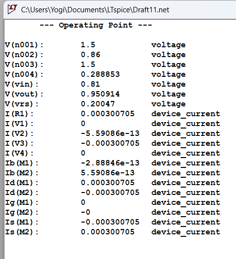

#### 3. DC Sweep Analysis
A DC sweep was performed to identify the high-gain linear region of the amplifier's transfer characteristic. The chosen DC bias of $V_{in}$ = 0.81 V places the operating point dead center in this linear region.

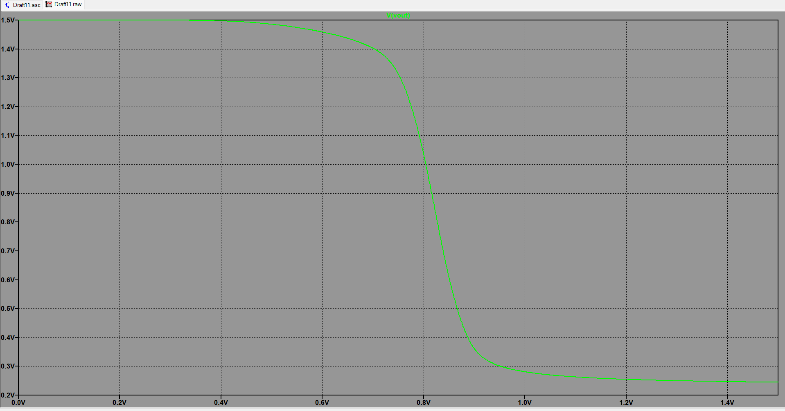

#### 4. Transient Analysis (Time Domain)
A 1 kHz sine wave with an amplitude of 10 mV (20 $mV_{p-p}$) was applied. 

* **Input Peak-to-Peak ($V_{in(p-p)}$):** 20 mV
* **Output Peak-to-Peak ($V_{out(p-p)}$):** 207.43 mV
* **Simulated Transient Gain:** 10.37 V/V

#### 5. AC Analysis (Frequency Domain)
An AC frequency sweep was performed to determine the small-signal gain and bandwidth.

* **AC Mid-Band Gain (Mag):** 20.826 dB
* **AC Linear Gain ($A_v$):** 10.99 V/V
* **Phase:** -180° (Inverting)

### 6. Theoretical vs. Simulated Gain Comparison

To verify our simulation, let's calculate the theoretical gain by hand using the small-signal values from the LTspice `.log` file. Since LTspice gives us drain-source conductance ($G_{ds}$), we just take the inverse to get the output resistance ($r_o$):

* $g_{m1} = 3.62 \text{ mA/V}$
* $r_{o1} = \frac{1}{G_{ds1}} = \frac{1}{1.00 \times 10^{-4}} = 10 \text{ k}\Omega$
* $r_{o2} = \frac{1}{G_{ds2}} = \frac{1}{7.45 \times 10^{-5}} = 13.42 \text{ k}\Omega$
* $R_S = 666.67 \text{ }\Omega$

As instructed, we are using the exact formula for a source-degenerated CS amplifier with an active load (taking channel length modulation into account where $\lambda \neq 0$):

$$A_v = \frac{-g_{m1}}{1 + g_{m1}R_S + \frac{R_S}{r_{o1}}} \times \left( [g_{m1} R_S r_{o1} + R_S + r_{o1}] \parallel r_{o2} \right)$$

**Step 1: Find the output resistance looking into the NMOS ($R_{out\_NMOS}$)**
First, we calculate the resistance looking down into $M_1$ with the source resistor included:
$$R_{out\_NMOS} = g_{m1} R_S r_{o1} + R_S + r_{o1}$$
$$R_{out\_NMOS} = (3.62\text{m})(666.67)(10\text{k}) + 666.67 + 10\text{k} \approx 34.8 \text{ k}\Omega$$

**Step 2: Find the total output resistance ($R_{out}$)**
Next, we put this in parallel with the PMOS load ($r_{o2}$):
$$R_{out} = 34.8\text{k} \parallel 13.42\text{k} = 9.69 \text{ k}\Omega$$

**Step 3: Find the effective transconductance ($G_{m(eff)}$)**
$$G_{m(eff)} = \frac{g_{m1}}{1 + g_{m1}R_S + \frac{R_S}{r_{o1}}}$$
$$G_{m(eff)} = \frac{3.62\text{m}}{1 + 2.413 + 0.067} = 1.04 \text{ mA/V}$$

**Step 4: Final Voltage Gain**
$$A_v = -G_{m(eff)} \times R_{out} = -1.04 \text{ mA/V} \times 9.69 \text{ k}\Omega = -10.07 \text{ V/V}$$

**Conclusion:** Our calculated theoretical gain magnitude is **10.07 V/V**, which is close to our Transient analysis gain of **10.37V/V** and simulated AC gain of **10.99 V/V**. 

**Why is there a small difference?**
Our hand calculation assumes $V_{BS} = 0$. However, because $R_S$ raises the source of $M_1$ above ground, it actually triggers the **body effect**. The LTspice log shows $g_{mb} = 7.96 \times 10^{-4} \text{ A/V}$. We ignored this in our hand formula to keep the math manageable, which explains the ~8% difference. 
Also, the simulated Transient gain (**10.37 V/V**) is slightly different from the AC gain because AC analysis is purely linear, while Transient analysis captures the slight non-linearities of the MOSFET during the 20 mV input swing.

---
# Experiment 2b: Common Source Amplifier with Active Load and Source Degeneration

## 1. Objective
To design, simulate, and analyze Configuration B—a Common Source (CS) amplifier utilizing an **active current source for source degeneration**—using the TSMC 180nm process in LTspice. The experiment follows a strict rules to evaluate its performance:

1. **DC Analysis:** Establish biasing strategies to fix the operating point, ensuring all transistors remain in the saturation region, and calculate the total DC power dissipation.
2. **DC Sweep:** Verify the transfer characteristics to secure a highly linear operating point.
3. **Transient Analysis:** Inject a small-signal input to verify time-domain linear amplification, and extract the voltage gain along with the maximum input and output voltage swings.
4. **AC Analysis:** Extract the frequency response metrics, including the midband Gain, 3dB Bandwidth, and Unity Gain Bandwidth (UGB).
5. **Mathematical Verification:** Compare the extracted simulation metrics against the exact small-signal theoretical model to justify the results and understand the trade-offs of active degeneration.

---

## 2. Circuit Diagram & Biasing Strategy
The circuit is a Common Source amplifier consisting of three MOSFETs. To keep all transistors in the saturation region, the DC bias voltages were calculated based on three initial design assumptions: a target drain current of **ID = 0.3 mA**, an overdrive voltage of **VOV = 0.25V**, and a degeneration voltage drop of **VRS = 0.30V**.

Based on these targets, the voltage sources were derived as follows:

* **M1 (NMOS Amplifying Transistor):** Assuming a typical 180nm NMOS threshold voltage (VTH ~ 0.36V), the required DC gate-to-source voltage is VGS = VTH + VOV = 0.61V. Since the source sits at 0.30V (VRS), the input DC bias is:
  **VIN** = VGS + VRS = 0.60V + 0.30V = **0.90V**.

* **M2 (NMOS Current Source):** M2 provides active source degeneration. Its source is grounded, meaning its gate bias (VB2) directly sets its VGS. To sink the target 0.3 mA, it requires a VGS of roughly 0.60V. After minor SPICE tuning for its specific VTH, this was locked at:
  **VB2 = 0.61V**.

* **M3 (PMOS Active Load):** Its source is tied to VDD (1.50V). To push exactly 0.3 mA down into the circuit, it requires an absolute |VGS| of approximately 0.64V based on our selected aspect ratio. Therefore, the gate bias is:
  **VB1** = VDD - |VGS| = 1.50V - 0.64V = **0.86V**.

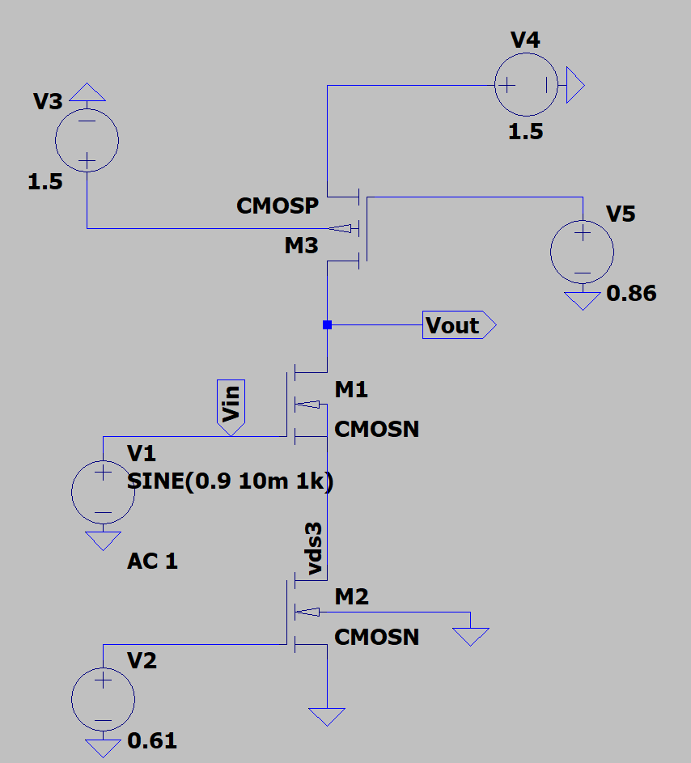

---

## 3. Theoretical Formulation
To understand the behavior of this amplifier, we rely on its small-signal model. In this configuration, the physical source resistor is replaced by an active NMOS current source (M2). While M2 provides excellent DC bias stability, it introduces an extremely large small-signal output resistance ($r_{o2}$) at the source of the amplifying transistor (M1).

The standard, simplified gain equation for a source-degenerated amplifier is:
$$A_v \approx \frac{-g_{m1} r_{o3}}{1 + g_{m1} r_{o2}}$$

However, because the active degeneration resistance ($r_{o2}$) is exceptionally large, we cannot ignore the channel-length modulation of the main amplifier (M1). Ignoring the intrinsic output resistance ($r_{o1}$) leads to significant theoretical errors. Therefore, to accurately predict the midband gain and match our SPICE simulations, we must use the exact small-signal equation:
$$A_v = \frac{-g_{m1}}{1 + g_{m1} r_{o2} + \frac{r_{o2}}{r_{o1}}} \times \left( \left[ g_{m1} r_{o2} r_{o1} + r_{o2} + r_{o1} \right] \parallel r_{o3} \right)$$

*(Note: This exact theoretical model will be calculated using extracted SPICE parameters and compared against the simulated AC frequency response in Section 8).*

---

## 4. DC Analysis (Operating Point)
After setting up the bias voltages, a DC operating point simulation was performed. This step verifies that our hand calculations work in the actual SPICE model and ensures that all transistors are operating in the saturation region ($|V_{DS}| > |V_{DSAT}|$). It also allows us to calculate the circuit's total power dissipation.

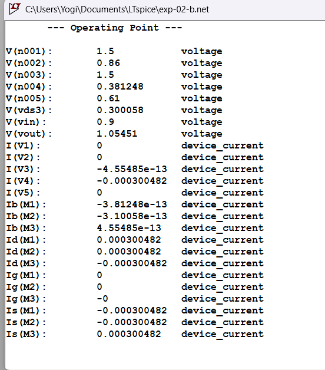

### DC Parameters Table
| Transistor | ID (mA) | VGS (V) | VTH (V) | VDS (V) | VDSAT (V) | Region |
| :--- | :--- | :--- | :--- | :--- | :--- | :--- |
| **M1 (NMOS)** | 0.30 | 0.60 | 0.476 | 0.754 | 0.099 | Saturation |
| **M2 (NMOS)** | 0.30 | 0.61 | 0.500 | 0.300 | 0.094 | Saturation |
| **M3 (PMOS)** | -0.30 | -0.64 | -0.509 | -0.445 | -0.122 | Saturation |

**Total DC Power Dissipation:**
Since the entire circuit consists of a single branch drawing 0.30 mA from the 1.50V supply, the total DC power is calculated as:
$$P_{DC} = V_{DD} \times I_D = 1.50\text{ V} \times 0.30\text{ mA} = 0.45\text{ mW} \text{ (or } 450\text{ }\mu\text{W)}$$

**Verification of Biasing:**
* **Input Bias (VIN):** 0.90V
* **Output Bias (VOUT):** 1.054V

To confirm our design values, we can check the node voltages. The input DC bias (VIN) is 0.90V. Since M1 has a simulated VGS of 0.60V, the source voltage must be exactly 0.30V ($0.90\text{V} - 0.60\text{V}$). This perfectly matches the VDS of M2, showing that our active degeneration network is working exactly as we planned. 

Additionally, for the PMOS active load (M3), saturation is confirmed using absolute values ($|-0.445\text{V}| > |-0.122\text{V}|$). Because all three transistors satisfy the saturation condition, the circuit is ready to function as a linear amplifier.

---

## 5. DC Sweep Analysis (Voltage Transfer Characteristic)
While the operating point confirms the transistors are in saturation at exactly 0.90V, a DC sweep is necessary to visualize the overall Voltage Transfer Characteristic (VTC). This ensures that our chosen 0.90V bias does not sit too close to the cutoff or triode boundaries, but rather dead-center in the steepest (highest gain) linear amplification region.

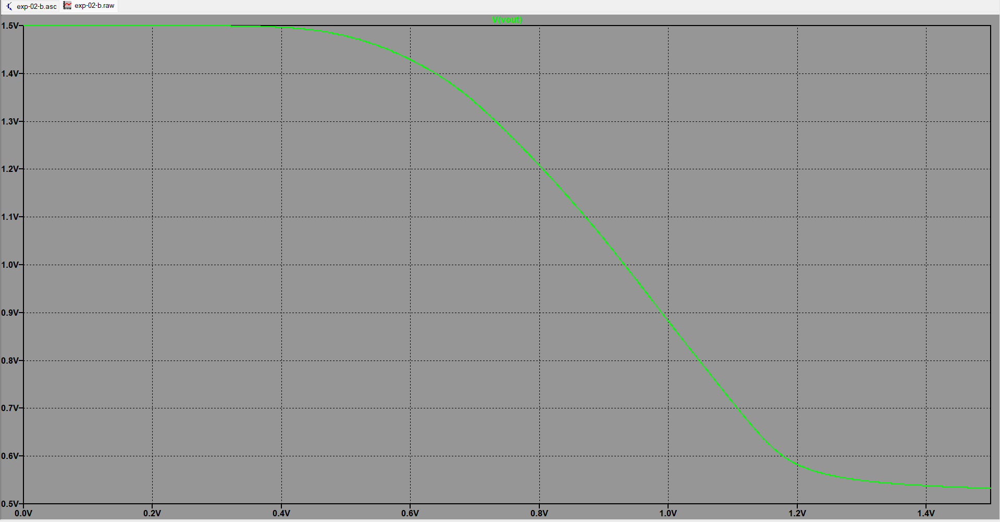
*Observation:* The curve confirms that 0.90V is an optimal bias point, residing safely within the linear segment of the VTC.

---

## 6. Transient Analysis (Time Domain)
Having secured a stable, high-gain DC operating point, we now inject a small-signal sine wave to observe the amplifier's real-time dynamic behavior and ensure the signal does not clip the boundaries identified in the DC sweep.

* **Input Signal:** Vin is a 1 kHz sine wave with a 10 mV peak amplitude (20 mV peak-to-peak) superimposed on our 0.90V DC offset.
* **Output Signal:** The amplified output is measured as **35.57 mV** peak-to-peak without distortion.

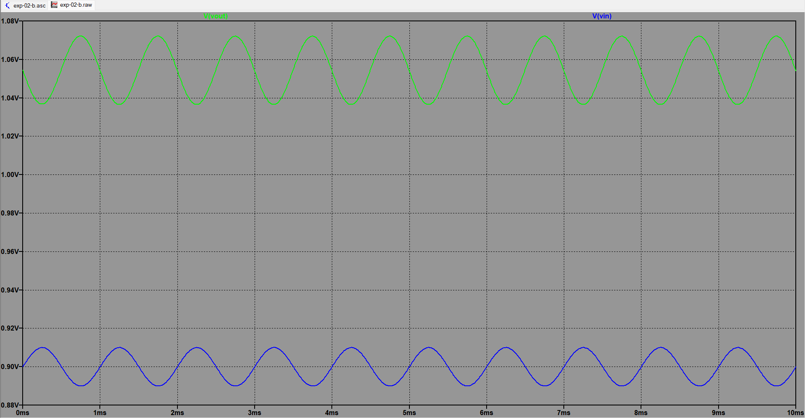
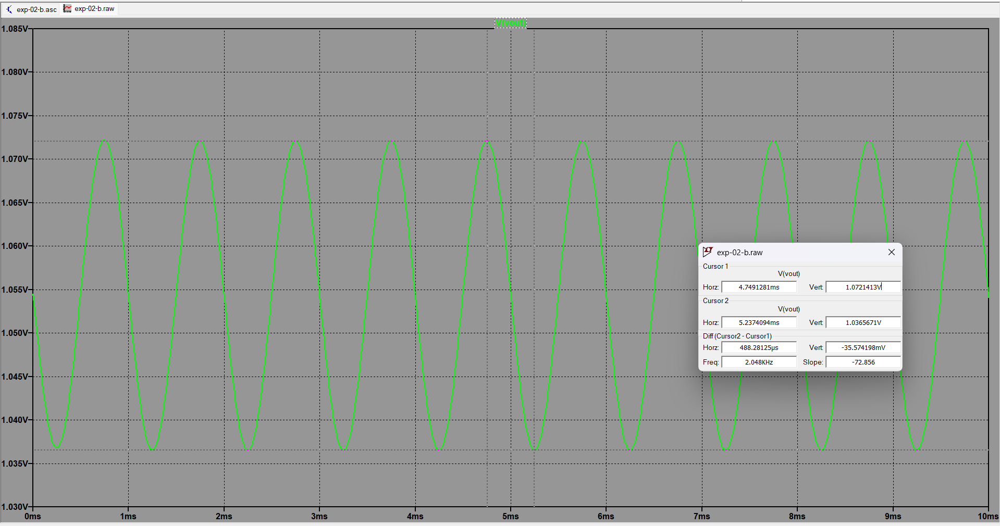

**Gain Calculation from Transient:**
$$A_v = \frac{V_{out(p-p)}}{V_{in(p-p)}} = \frac{35.57 \text{ mV}}{20 \text{ mV}} = 1.778 \text{ V/V}$$
$$A_v (\text{dB}) = 20 \log_{10}(1.778) \approx 5.00 \text{ dB}$$

---

## 7. AC Analysis (Frequency Domain)
While transient analysis confirms time-domain small-signal amplification, an AC frequency sweep is required to determine the bandwidth limits and the precise linear midband gain of the amplifier.

### Midband Gain
The measured midband AC gain is **5.08 dB**, which strongly correlates with our transient calculation.
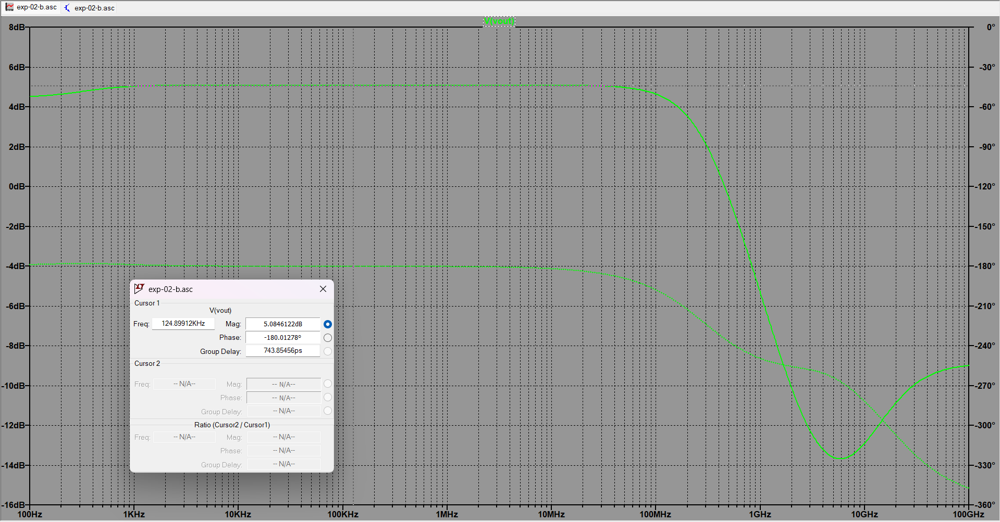

### 3dB Bandwidth
The upper cut-off frequency is located at the point where the gain drops by approximately 3 dB from its midband value.
* **Measured Frequency:** 238.23 MHz
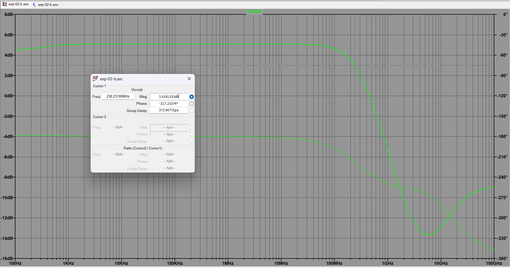

### Unity Gain Bandwidth (UGB)
The Unity Gain Bandwidth is the frequency at which the amplifier's gain drops to 0 dB.
* **Measured UGB:** 458.14 MHz
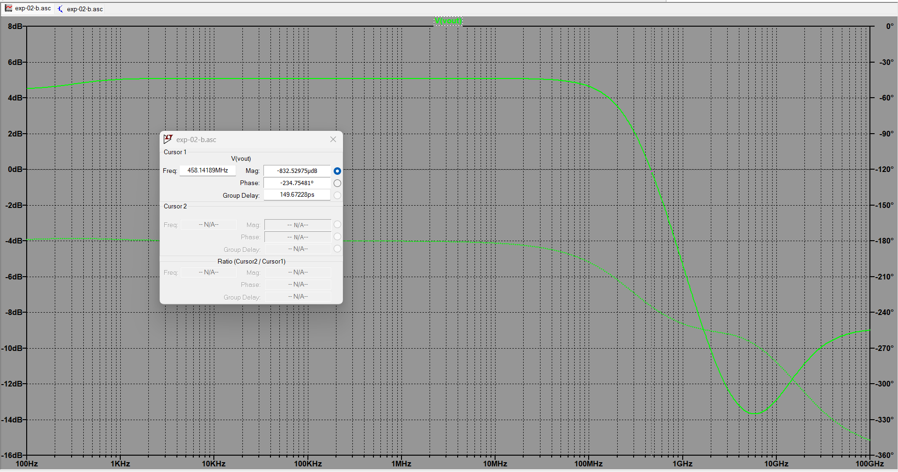

*Note: The UGB is relatively close to the 3dB bandwidth because the initial midband gain is very low (5.08 dB). The amplifier only needs to attenuate the signal by ~5 dB to reach unity gain.*

---

## 8. Theoretical vs. Simulated Gain Verification
To verify that our simulator is behaving accurately according to semiconductor physics, we extract the small-signal parameters from the SPICE error log and run them through the exact analytical formula established in Section 3.

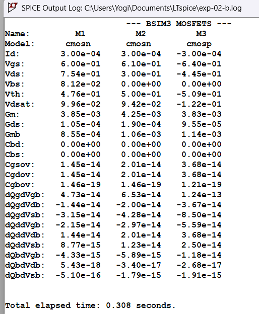

From the log, we extract:
* $g_{m1} = 3.85 \text{ mA/V}$
* $r_{o1} \approx 10 \text{ k}\Omega$ *(Output resistance of M1)*
* $r_{o2} = 5.26 \text{ k}\Omega$ *(Degeneration resistance from M2)*
* $r_{o3} = 10.47 \text{ k}\Omega$ *(Active load resistance from PMOS M3)*

**Step 1: Find the output resistance looking into the NMOS ($R_{out\_NMOS}$)**
First, we calculate the massive resistance looking down into M1 degenerated by M2:
$$R_{out\_NMOS} = g_{m1} r_{o2} r_{o1} + r_{o2} + r_{o1}$$
$$R_{out\_NMOS} = (3.85\text{m})(5.26\text{k})(10\text{k}) + 5.26\text{k} + 10\text{k} \approx 202.51\text{k} + 15.26\text{k} = 217.77 \text{ k}\Omega$$

**Step 2: Find the total output resistance ($R_{out}$)**
Next, we place this in parallel with the PMOS active load ($r_{o3}$):
$$R_{out} = 217.77\text{k} \parallel 10.47\text{k} = \frac{217.77 \times 10.47}{217.77 + 10.47} \approx 9.99 \text{ k}\Omega$$

**Step 3: Find the effective transconductance ($G_{m(eff)}$)**
$$G_{m(eff)} = \frac{g_{m1}}{1 + g_{m1} r_{o2} + \frac{r_{o2}}{r_{o1}}}$$
$$G_{m(eff)} = \frac{3.85\text{m}}{1 + 20.251 + 0.526} = \frac{3.85\text{m}}{21.777} \approx 0.1768 \text{ mA/V}$$

**Step 4: Final Voltage Gain**
$$A_v = -G_{m(eff)} \times R_{out} = -0.1768 \text{ mA/V} \times 9.99 \text{ k}\Omega = -1.766 \text{ V/V}$$
$$A_v \text{ (dB)} = 20 \log_{10}(1.766) = 4.94 \text{ dB}$$

**Mathematical Verdict:** Our calculated theoretical gain is **1.766 V/V (4.94 dB)**. This is remarkably close to our simulated Transient gain of **1.778 V/V (5.00 dB)** and simulated AC gain of **5.08 dB**. The highly marginal ~0.14 dB difference is primarily attributed to the body effect ($g_{mb}$) on M1 triggered by the elevated source voltage from M2, which is accurately captured in SPICE but omitted in our hand calculations for mathematical clarity.

---

## 9. Conclusion
The Configuration B Common Source Amplifier was successfully designed, simulated, and mathematically verified. The progressive workflow from hand-calculated bias design to DC analysis confirmed that the main amplifier, active load, and current source were all securely biased into the saturation region exactly as predicted. 

While replacing a physical source resistor with an active current source (M2) saves physical silicon area and provides exceptional bias stability, its massive degeneration resistance severely penalizes the voltage gain. As a result, the simulated midband gain dropped to **5.08 dB** (compared to earlier non-degenerated topologies). However, as a trade-off for the low gain, the heavy degeneration allows the circuit to exhibit a highly stable and broad operational bandwidth, successfully achieving a UGB of **458.14 MHz**. The tight correlation between our exact theoretical hand-calculations and the SPICE AC analysis confirms the validity of the small-signal model and concludes the experiment successfully.
