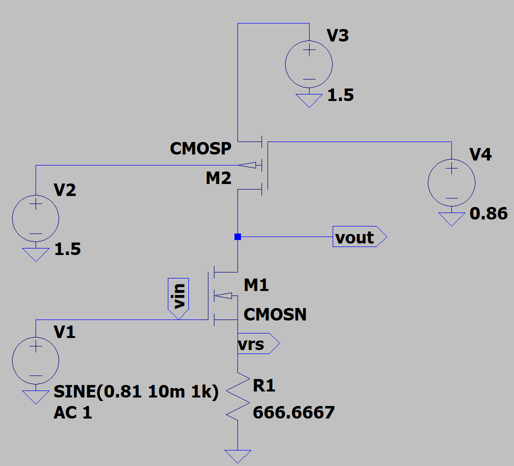
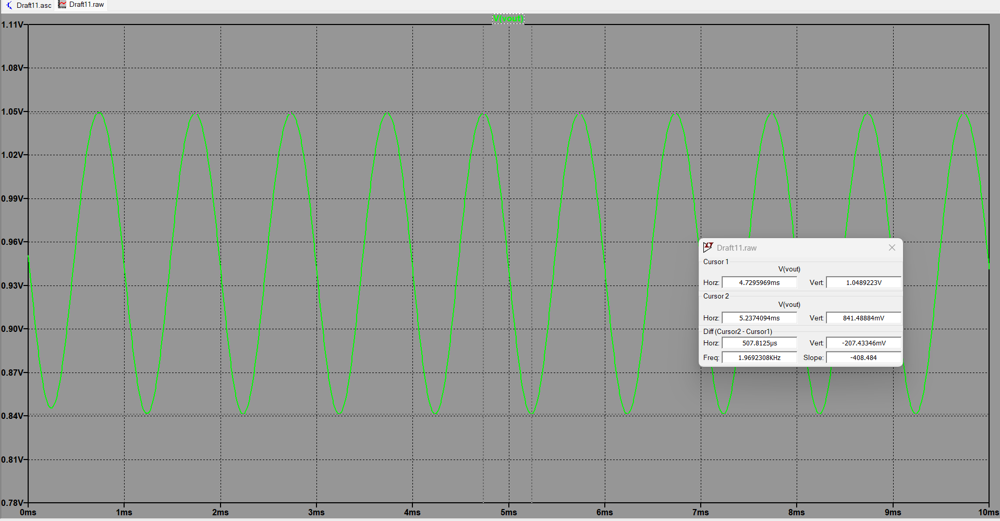
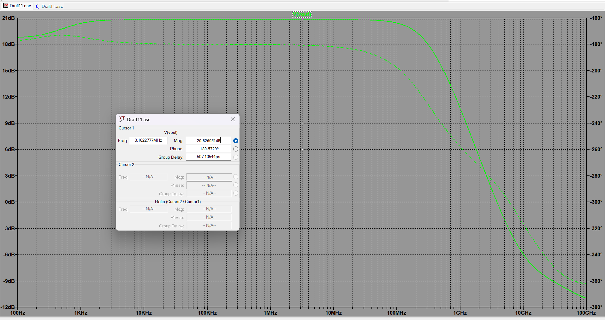

# Experiment 02: CS Amplifier Configurations using TSMC 180nm

## 1. Objective
To design and compare three different Common Source (CS) amplifier configurations using the TSMC 180nm parameter library in LTspice. The objective is to extract specific performance metrics, compare the configurations, and justify the interpretations.

---

## 2. Theory & Circuit Configurations
All three circuits utilize a PMOS active load ($M_2$) to provide a high output resistance, maximizing the intrinsic gain. The primary differences lie in the source degeneration networks applied to the input amplifying transistor ($M_1$).

### Configuration A: Resistor Degeneration ($R_S$)
* **Description:** A physical resistor $R_S$ is placed at the source of the input NMOS ($M_1$).
* **Purpose:** This provides ideal, perfectly linear source degeneration. It stabilizes the DC operating point and makes the amplifier highly linear, though it sacrifices some voltage gain. 
* **Trade-off:** Physical resistors consume a massive amount of silicon area in IC design and are subject to high manufacturing variations, making this configuration impractical for compact integrated circuits.
* **Theoretical Gain:** $$A_v=\frac{-g_{m1}}{1+g_{m1}R_S}$$

### Configuration B: Active Current Source Degeneration
* **Description:** The resistor is replaced by an NMOS ($M_3$) biased by a fixed DC voltage ($V_{B2}$), operating as a constant current source.
* **Purpose:** A MOSFET in saturation provides an extremely high output resistance ($r_{o3}$). This applies heavy degeneration, ensuring rock-solid DC bias stability without taking up the massive footprint of a physical resistor.
* **Trade-off:** The massive AC resistance looking into the drain of $M_3$ severely degrades the AC voltage signal. This is typically used for specific biasing control rather than maximizing signal amplification.

//

### Configuration C: Diode-Connected Degeneration
* **Description:** The source of $M_1$ is tied to an NMOS ($M_3$) configured with its gate and drain shorted together (diode-connected).
* **Purpose:** This is the IC designer's space-saving alternative to Configuration A. The diode-connected MOSFET acts as a small-signal resistor with a value of approximately $1/g_{m3}$. 
* **Advantage:** Because $M_1$ and $M_3$ are built on the same silicon, their transconductances ($g_{m1}$ and $g_{m3}$) track each other across temperature and process variations. The gain becomes a stable ratio of these parameters, making the circuit incredibly resilient.
* **Theoretical Gain (Approximate):**
  $$A_v\approx\frac{-g_{m1}}{1+\frac{g_{m1}}{g_{m3}}}$$

## 3. Simulation Results & Analysis

### 3.1 Configuration A: Resistor Degeneration ($R_S$)

#### 1. Transistor Sizing & Design Parameters
In 180nm CMOS design, the aspect ratios ($W/L$) are the primary design variables. The following sizes were utilized to achieve the desired operating point:
* **$M_1$ (NMOS Amplifying Device):** W = 15.3µm, L = 180nm
* **$M_2$ (PMOS Active Load):** W = 56.35µm, L = 180nm

#### 2. DC Analysis & Saturation Verification
The operating point was set to ensure all transistors operate securely in the saturation region. A source resistor $R_S$ of 666.67 Ω was used.

* **Supply Voltage ($V_{DD}$):** 1.5 V
* **Drain Current ($I_D$):** 300.7 µA
* **Total DC Power Dissipation:** 451.05 µW

**Saturation Proof for $M_1$:**
To act as a linear amplifier, $M_1$ must satisfy $V_{DS} > V_{GS} - V_{TH}$ (or $V_{DS} > V_{OV}$).
From the SPICE output log:
* $V_{GS}$ = 0.610 V
* $V_{TH}$ = 0.474 V
* Overdrive Voltage ($V_{OV}$) = 0.610 - 0.474 = 0.136 V
* Actual $V_{DS}$ = 0.750 V

Since **0.750 V > 0.136 V**, the amplifying transistor $M_1$ is deeply in saturation.

#### 3. DC Sweep Analysis
A DC sweep was performed to identify the high-gain linear region of the amplifier's transfer characteristic. The chosen DC bias of $V_{in}$ = 0.81 V places the operating point dead center in this linear region.

#### 4. Transient Analysis (Time Domain)
A 1 kHz sine wave with an amplitude of 10 mV (20 $mV_{p-p}$) was applied. 

* **Input Peak-to-Peak ($V_{in(p-p)}$):** 20 mV
* **Output Peak-to-Peak ($V_{out(p-p)}$):** 207.43 mV
* **Simulated Transient Gain:** 10.37 V/V

#### 5. AC Analysis (Frequency Domain)
An AC frequency sweep was performed to determine the small-signal gain and bandwidth.

* **AC Mid-Band Gain (Mag):** 20.826 dB
* **AC Linear Gain ($A_v$):** 10.99 V/V
* **Phase:** -180° (Inverting)

### 6. Theoretical vs. Simulated Gain Comparison

To verify our simulation, let's calculate the theoretical gain by hand using the small-signal values from the LTspice `.log` file. Since LTspice gives us drain-source conductance ($G_{ds}$), we just take the inverse to get the output resistance ($r_o$):

* $g_{m1} = 3.62 \text{ mA/V}$
* $r_{o1} = \frac{1}{G_{ds1}} = \frac{1}{1.00 \times 10^{-4}} = 10 \text{ k}\Omega$
* $r_{o2} = \frac{1}{G_{ds2}} = \frac{1}{7.45 \times 10^{-5}} = 13.42 \text{ k}\Omega$
* $R_S = 666.67 \text{ }\Omega$

As instructed, we are using the exact formula for a source-degenerated CS amplifier with an active load (taking channel length modulation into account where $\lambda \neq 0$):

$$A_v = \frac{-g_{m1}}{1 + g_{m1}R_S + \frac{R_S}{r_{o1}}} \times \left( [g_{m1} R_S r_{o1} + R_S + r_{o1}] \parallel r_{o2} \right)$$

**Step 1: Find the output resistance looking into the NMOS ($R_{out\_NMOS}$)**
First, we calculate the resistance looking down into $M_1$ with the source resistor included:
$$R_{out\_NMOS} = g_{m1} R_S r_{o1} + R_S + r_{o1}$$
$$R_{out\_NMOS} = (3.62\text{m})(666.67)(10\text{k}) + 666.67 + 10\text{k} \approx 34.8 \text{ k}\Omega$$

**Step 2: Find the total output resistance ($R_{out}$)**
Next, we put this in parallel with the PMOS load ($r_{o2}$):
$$R_{out} = 34.8\text{k} \parallel 13.42\text{k} = 9.69 \text{ k}\Omega$$

**Step 3: Find the effective transconductance ($G_{m(eff)}$)**
$$G_{m(eff)} = \frac{g_{m1}}{1 + g_{m1}R_S + \frac{R_S}{r_{o1}}}$$
$$G_{m(eff)} = \frac{3.62\text{m}}{1 + 2.413 + 0.067} = 1.04 \text{ mA/V}$$

**Step 4: Final Voltage Gain**
$$A_v = -G_{m(eff)} \times R_{out} = -1.04 \text{ mA/V} \times 9.69 \text{ k}\Omega = -10.07 \text{ V/V}$$

**Conclusion:** Our calculated theoretical gain magnitude is **10.07 V/V**, which is close to our Transient analysis gain of **10.37V/V** and simulated AC gain of **10.99 V/V**. 

> **Why is there a small difference?**
> Our hand calculation assumes $V_{BS} = 0$. However, because $R_S$ raises the source of $M_1$ above ground, it actually triggers the **body effect**. The LTspice log shows $g_{mb} = 7.96 \times 10^{-4} \text{ A/V}$. We ignored this in our hand formula to keep the math manageable, which explains the ~8% difference. 
> Also, the simulated Transient gain (**10.37 V/V**) is slightly different from the AC gain because AC analysis is purely linear, while Transient analysis captures the slight non-linearities of the MOSFET during the 20 mV input swing.
