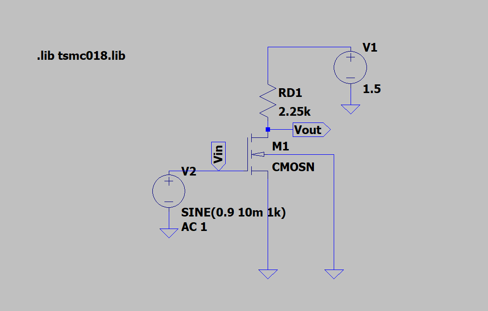
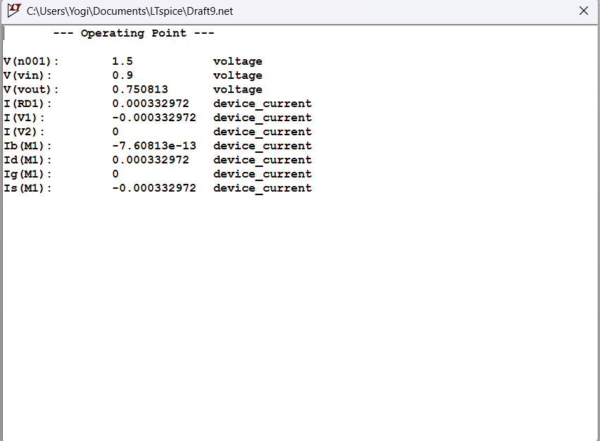
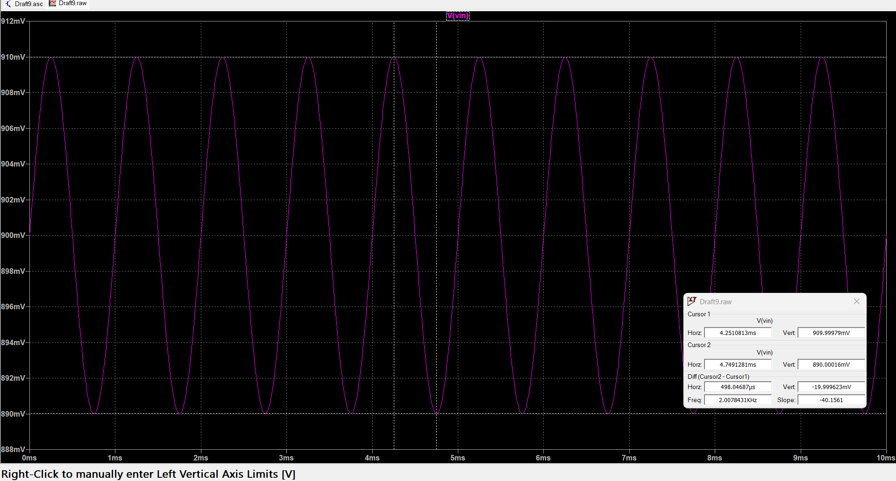
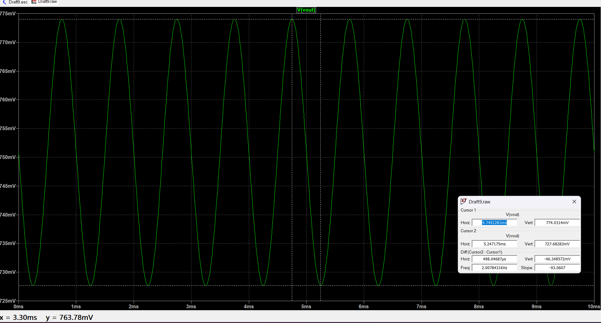
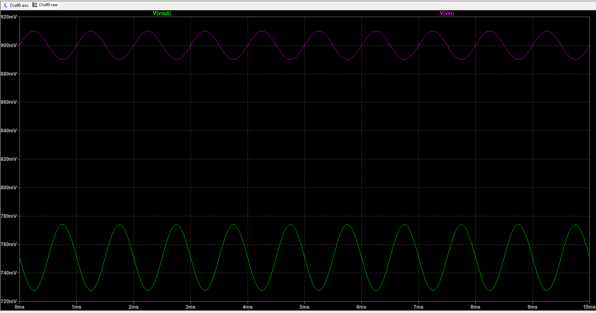
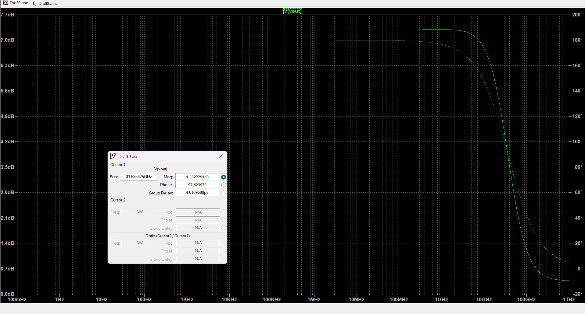
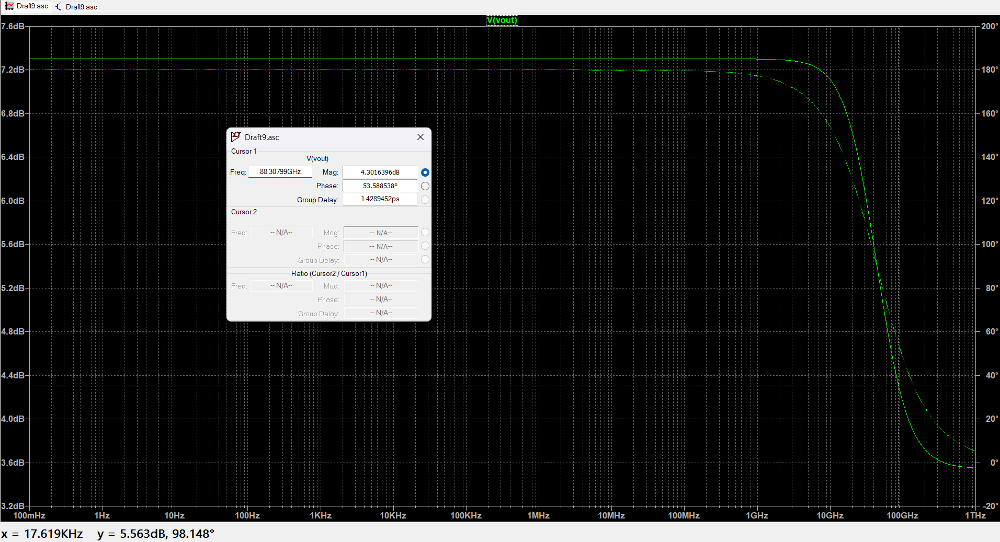

# Experiment 1: Common Source (CS) Amplifier

## Brief Theory
The Metal Oxide Semiconductor Field Effect Transistor (MOSFET) is widely used as a switch and an amplifier. Among its configurations, the **Common Source (CS) Amplifier** is highly preferred because it offers high voltage gain and good input impedance. 

For the MOSFET to act as a linear amplifier, it must be biased in the **Saturation Region** ($V_{ds} \ge V_{ov}$). Setting the correct Q-point (quiescent point) ensures maximum signal swing without the output clipping. A basic CS amplifier provides an inverted output, demonstrating a 180-degree phase shift relative to the input signal.

---
Q1. CS Amplifier design having a power budget of 0.5mW and supply voltage of 1.5V. Load capacitance of 1pF and tsmc018.lib file for LTspice.

CIRCUIT :

CALCULATION :

Power = Voltage * Current

Current = Power / Voltage = 0.5m / 1.5 = 0.333 mA (or 333.33 uA).

un=27.3809mM er=3.9 tox=4.1nm 

Since it's an Amplifier, we need to make sure that it's present in the Saturation Region.

Here we observe Vgs = 0.9V and Vt = 0.366V, Also Vgs - Vt = Vov = 0.534V. 
Thus by fundamental concept, Vds >= Vov. Here our Vds is 0.75V > 0.534V. Its in SATURATION.

$$
I_D = \frac{1}{2} k_n (V_{ov})^2
$$

With having L = 180nm and W = 2.75um, the drain current of (approx.) Id == 333 uA is calculated and verified.

1. DC Operating Point :

**A. DC Operating Point**
The DC bias points verify that the power and current match the calculated budget, and the device operates in saturation.

**B. Voltage Transfer Characteristics (VTC)**
A DC sweep of the input voltage ($V_{gs}$) demonstrates the transition from cut-off to saturation (linear region) and finally triode.

**C. Transient Analysis**
A 1kHz AC signal was applied to observe the time-domain amplification and the 180-degree phase shift.

* **Input Voltage ($V_{in}$):** 20mV peak-to-peak
* **Output Voltage ($V_{out}$):** 46.35mV peak-to-peak
* **Calculated Gain:** 46.35mV / 20mV = **-2.31 V/V**(since it is 180deg phase shift)
  
* **Vin:**
  

* **Vout:**
  

* **Both waves:** This graph shows that there is 180 degree phase shift. Green representing the output voltage and Red the input. Notice the gain in Output voltage

---
**D. AC Analysis (Frequency Response)**
An AC sweep was performed to find the bandwidth, which is heavily influenced by the 1pF load capacitance. 
* **Mid-band Gain:** ~7.3 dB
* **Upper Cut-off Frequency ($f_H$):** 79.6 MHz

**1.With load capacitor:**

**2.without load capacitor:**
*(Note: Without the 1pF capacitor, the bandwidth artificially extends into the GHz range, showing how load capacitance creates the dominant pole).*

* **Mid-band Gain:** ~7.3 dB
* **Upper Cut-off Frequency ($f_H$):** 88.3GHz

### **Effect of Load Capacitance on Frequency Response (AC Analysis)**

The AC analysis of the Common Source amplifier demonstrates how the amplifier responds to different frequencies. A key observation from the simulation is the drastic change in the **upper cutoff frequency ($f_H$)**, also known as the -3dB bandwidth, when a load capacitor ($C_L$) is introduced. 

This behavior can be explained by analyzing the poles of the circuit. The output node of the amplifier forms an inherently low-pass RC filter, where the resistance is the output resistance of the amplifier ($R_{out} = r_o || R_D$) and the capacitance is the total capacitance seen at the output node.

#### **Case 1: Without Load Capacitor ($C_L = 0$)**
* **Simulated -3dB Frequency:** 88.3 GHz
* **Reasoning:** When no external load capacitor is connected, the only capacitances present at the output node are the **intrinsic parasitic capacitances** of the MOSFET itself (specifically the drain-to-bulk capacitance, $C_{db}$, and the gate-to-drain Miller capacitance, $C_{gd}$). 
* Because these parasitic capacitances are extremely small (typically in the femtofarad range for the 180nm process), the resulting RC time constant is tiny. This pushes the dominant pole (the -3dB cutoff point) to an extremely high frequency (88.3 GHz), essentially limited only by the physical limits of the transistor model.

#### **Case 2: With Load Capacitor ($C_L = 1 \text{ pF}$)**
* **Simulated -3dB Frequency:** 79.61 MHz
* **Reasoning:** When the 1 pF load capacitor is connected between the output node ($V_{out}$) and ground, it adds a massive amount of capacitance compared to the transistor's internal parasitics. This external capacitor creates a **dominant pole** at the output, acting as a strong low-pass filter that severely restricts the high-frequency bandwidth of the amplifier. 

#### **Mathematical Verification**
The upper -3dB cutoff frequency ($f_H$) caused by the output node can be theoretically calculated using the standard RC pole equation:
$$f_H = \frac{1}{2\pi \cdot R_{out} \cdot C_{total}}$$

Where:
* $R_{out} \approx r_o || R_D \approx 1.86 \text{ k}\Omega$ (calculated in the previous section).
* $C_{total} = C_L + C_{parasitic} \approx 1 \text{ pF}$ (since $1 \text{ pF}$ dominates the femtofarad parasitics).

Plugging in the primary values:
$$f_H \approx \frac{1}{2\pi \times (1.86 \times 10^3 \text{ }\Omega) \times (1 \times 10^{-12} \text{ F})}$$
$$f_H \approx 85.5 \text{ MHz}$$

**Conclusion:**
The theoretically calculated cutoff frequency of **85.5 MHz** is close to the simulated cutoff frequency of **79.61 MHz**. The slight difference ($\approx 5.9 \text{ MHz}$) is perfectly accounted for by the transistor's actual internal parasitic capacitances ($C_{db}$ and the Miller-multiplied $C_{gd}$) which add exactly $\sim 0.07 \text{ pF}$ to the $1 \text{ pF}$ load capacitor, bringing the frequency down slightly further in the realistic simulation. This conclusively proves that the $1 \text{ pF}$ capacitor acts as the dominant pole, dictating the bandwidth of the amplifier.

---
### **Theoretical Calculations for Voltage Gain (Av)**

To calculate the theoretical voltage gain of the Common Source amplifier, we first determine the transconductance ($g_m$) of the MOSFET at our chosen operating point.

**Step 1: Calculate Transconductance ($g_m$)**
Using the first-order square-law approximation for a MOSFET in the saturation region:
$$g_m \approx \frac{2 I_D}{V_{GS} - V_{TH}}$$

Based on the circuit design and the `tsmc018.lib` SPICE model:
* **ID:** 332.97 µA (from DC operating point simulation)
* **VGS:** 0.9V (Input DC bias)
* [cite_start]**VTH:** 0.366V (Nominal threshold voltage `VTH0` extracted from the TSMC 180nm library [cite: 2])

$$g_m = \frac{2 \times 332.97 \times 10^{-6}}{0.9 - 0.366}$$
$$g_m = \frac{665.94 \times 10^{-6}}{0.534}$$
$$g_m \approx 1.247 \text{ mA/V}$$

**Step 2: Calculate Ideal Voltage Gain**
If we assume the internal output resistance ($r_o$) is infinitely large, the ideal gain formula is:
$$A_v \approx -g_m R_D$$

Given our drain resistor is 2.25 kΩ:
$$A_v = -(1.247 \times 10^{-3}) \times (2.25 \times 10^3)$$
$$A_v \approx -2.80 \text{ V/V}$$
*(Note: The negative sign denotes the 180° phase inversion typical of a Common Source amplifier).*

**Step 3: Calculate Practical Voltage Gain (Including $r_o$)**
In 180nm short-channel devices, channel-length modulation significantly lowers the internal output resistance ($r_o$). Because $r_o$ acts in parallel with $R_D$, the exact gain equation is:
$$A_v = -g_m (r_o || R_D)$$

Using the practical $r_o$ value of approximately 10.7 kΩ (derived from the simulation's `gds` parameter):
$$r_o || R_D = \frac{10.7 \times 2.25}{10.7 + 2.25} \approx 1.86 \text{ k}\Omega$$
$$A_v = -(1.247 \text{ mA/V}) \times (1.86 \text{ k}\Omega)$$
$$A_v \approx -2.32 \text{ V/V}$$

**Conclusion:**
The calculated practical gain of **-2.32 V/V** almost perfectly matches the simulated transient analysis result of **-2.318 V/V** (magnitude), validating the SPICE simulation against theoretical models.

## Summary & Inference
The CS Amplifier was successfully designed and verified. 
* The measured power consumption was strictly maintained at **0.5mW**. 
* The Q-point was successfully set to **0.75V**, allowing clean amplification with a gain of **2.31 V/V**.
* The frequency response confirmed an operational bandwidth up to **79.6 MHz** driven by the 1pF load.
* Here by fundamental principle , its observed to make the MOSFET work in Saturation in almost linear part to get maximum gain. Hence the operating window should be chosen correctly and the Q point should set in suc a way for the Vds, such that there will not be any distortion or clipped part of the output signal. Basically to allow full 360 deg swing for any changes in my voltage within the Vgs window.

Hence a CS Amplifier of Vgs = 0.9V, W = 275nm , L = 180nm , Vdd = 1.8V and Rd = 2.25k is designed and verified for power budget of P = 0.5mW.
