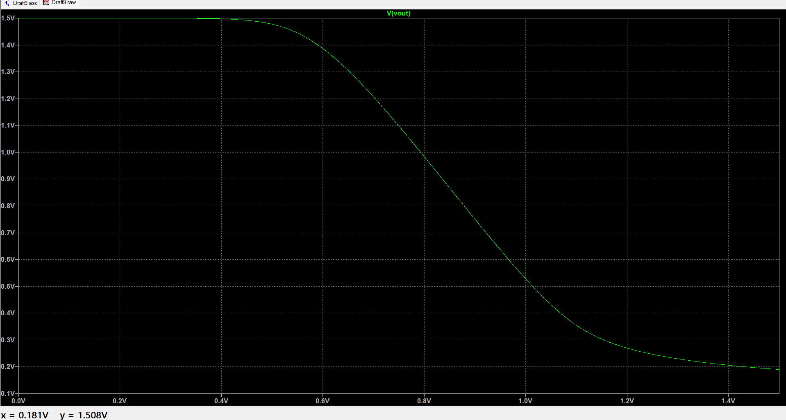

# Experiment 1: Common Source (CS) Amplifier

## 📖 Brief Theory
The Metal Oxide Semiconductor Field Effect Transistor (MOSFET) is widely used as a switch and an amplifier. Among its configurations, the **Common Source (CS) Amplifier** is highly preferred because it offers high voltage gain and good input impedance. 

For the MOSFET to act as a linear amplifier, it must be biased in the **Saturation Region** ($V_{ds} \ge V_{ov}$). Setting the correct Q-point (quiescent point) ensures maximum signal swing without the output clipping. A basic CS amplifier provides an inverted output, demonstrating a 180-degree phase shift relative to the input signal.

---
Q1. CS Amplifier design having a power budget of 0.5mW and supply voltage of 1.5V. Load capacitance of 1pF and tsmc018.lib file for LTspice.

CIRCUIT :

CALCULATION :

Power = Voltage * Current

Current = Power / Voltage = 0.5m / 1.5 = 0.333 mA (or 333.33 uA).

Since it's an Amplifier, we need to make sure that it's present in the Saturation Region.

Here we observe Vgs = 0.9V and Vt = 0.366V, Also Vgs - Vt = Vov = 0.534V. 
Thus by fundamental concept, Vds >= Vov. Here our Vds is 0.75V > 0.534V. Its in SATURATION.

With having L = 180nm and W = 2.75um, the drain current of (approx.) Id == 333 uA is calculated and verified.

1. DC Operating Point :

**A. DC Operating Point**
The DC bias points verify that the power and current match the calculated budget, and the device operates in saturation.

**B. Voltage Transfer Characteristics (VTC)**
A DC sweep of the input voltage ($V_{gs}$) demonstrates the transition from cut-off to saturation (linear region) and finally triode.

**C. Transient Analysis**
A 1kHz AC signal was applied to observe the time-domain amplification and the 180-degree phase shift.
* **Input Voltage ($V_{in}$):** 20mV peak-to-peak
* **Output Voltage ($V_{out}$):** 46.35mV peak-to-peak
* **Calculated Gain:** 46.35mV / 20mV = **2.31 V/V**
* **Vin:**

* **Vout:**

.

* **Both waves:** This graph shows that there is 180 degree phase shift. Green representing the output voltage and Red the input. Notice the gain in Output voltage

**D. AC Analysis (Frequency Response)**
An AC sweep was performed to find the bandwidth, which is heavily influenced by the 1pF load capacitance. 
* **Mid-band Gain:** ~7.3 dB
* **Upper Cut-off Frequency ($f_H$):** 79.6 MHz

This graph provides the Frequency Response of the Circuit. At higher cutoff frequency of 1Ghz , beyond this the Gain decreases due to effect of parasitic capacitance of MOSFET and other components. Bandwidth is given by B.W = Upper Cutoff Frequency{Fh} - Lower Cutoff Frequency{Fl} = 1Ghz. This provides the range of frequency where no capacitance comes into play and all capacitors act as AC SHORT.

*(Note: Without the 1pF capacitor, the bandwidth artificially extends into the GHz range, showing how load capacitance creates the dominant pole).*

---

## 📝 Summary & Inference
The CS Amplifier was successfully designed and verified. 
* The measured power consumption was strictly maintained at **0.5mW**. 
* The Q-point was successfully set to **0.75V**, allowing clean amplification with a gain of **2.31 V/V**.
* The frequency response confirmed an operational bandwidth up to **79.6 MHz** driven by the 1pF load.
* Here by fundamental principle , its observed to make the MOSFET work in Saturation in almost linear part to get maximum gain. Hence the operating window should be chosen correctly and the Q point should set in suc a way for the Vds, such that there will not be any distortion or clipped part of the output signal. Basically to aloow full 360 deg swing for any changes in my voltage within the Vgs window.

Hence a CS Amplifier of Vgs = 0.9V, W = 275nm , L = 180nm , Vdd = 1.8V and Rd = 2.25k is designed and verified for power budget of P = 0.5mW.
